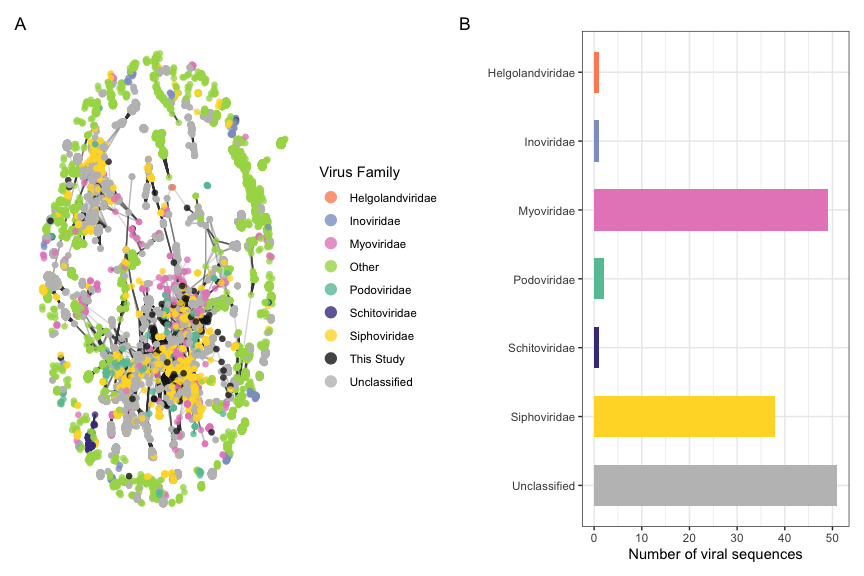

R Analysis of Antarctic Metagenome Viral Communities
================
Cassie Ettinger

# Load Libraries

``` r
library(GGally)
library(tidyverse)
library(scales)
library(network)
library(vroom)
library(phyloseq)
library(microbiome)
library(vegan)
library(pairwiseAdonis)
library(patchwork)
library(ggnewscale)
library(ggforce)
library(geosphere)
library(rnaturalearth)
library(sf)
library(rnaturalearthdata)
library(biobroom)
```

# vOTU processing

Following some of Christian Santos Medellin’s scripts:
<https://github.com/cmsantosm/SpatioTemporalViromes/blob/master/Processing/Scripts/votu_filtering.Rmd>

``` r
# run on UCR cluster get file names
dir <- "data/coverage/"
cov.files <- list.files(path = dir, pattern = "*.tsv", full.names = T)
cov.files
sampleid <- list.files(path = dir, pattern = "*.tsv", full.names = F) %>%
    str_remove("_mapped_coverge.tsv")  #whoops! mispelled coverage
sampleid

# open coverage files
cov.list <- lapply(cov.files, read.table, sep = "\t", header = F,
    col.names = c("contig", "start", "end", "coverage"))
names(cov.list) <- sampleid


# Christian's function to get coverage for each vOTUs in
# each bed file and filter out instances in which coverage
# is < 0.75

get_coverage <- function(df) {
    df %>%
        mutate(nbase = end - start) %>%
        group_by(contig) %>%
        mutate(length = sum(nbase)) %>%
        mutate(perc_seq = nbase/length) %>%
        filter(coverage > 0) %>%
        summarise(total_coverage = sum(perc_seq)) %>%
        filter(total_coverage >= 0.75)
}


# Apply the function to all coverage files

cov.list.proc <- lapply(cov.list, get_coverage)
cov.list.proc


# Make the list into a data frame

cov.df <- plyr::ldply(cov.list.proc, function(x) x) %>%
    rename(SampleID = ".id")

cov.df

# saveRDS(cov.df, 'results/processed_data/cov.df.RDS')

# Convert it to a matrix

cov.mtx <- cov.df %>%
    spread(key = SampleID, value = total_coverage) %>%
    as.data.frame()
row.names(cov.mtx) <- cov.mtx$contig
cov.mtx <- cov.mtx[, -1]
cov.mtx

# Remove NAs

cov.mtx <- !is.na(cov.mtx)

# saveRDS(cov.mtx, 'results/processed_data/cov.mtx.RDS')

cov.mtx <- readRDS("results/processed_data/cov.mtx.RDS")

# Get the tpmean table generated from BAMM and keep only
# those instances where coverage >= 0.75 we had a few
# samples missing that we added back in later, hence the
# need to join files here
tpmean1 <- vroom("data/relative_abundance/output_file_tpmean_072622.tsv")
tpmean2 <- vroom("data/relative_abundance/output_file_tpmean_missing_080422.tsv")

tpmean <- full_join(tpmean1, tpmean2)

tpmean
rownames(tpmean) <- tpmean$`#contig`
tmp <- colnames(tpmean)
tmp <- str_remove(tmp, "_sortedIndexed.bam")
tmp <- str_remove(tmp, "data/fastq/bbmap/")
colnames(tpmean) <- tmp
tpmean.75 <- tpmean[match(row.names(cov.mtx), row.names(tpmean)),
    match(colnames(cov.mtx), colnames(tpmean))]
tpmean.75 <- cov.mtx * tpmean.75
rownames(tpmean.75) <- row.names(cov.mtx)
tpmean.75.tidy <- tpmean.75 %>%
    as.data.frame() %>%
    mutate(OTU_ID = row.names(.)) %>%
    gather(key = "SampleID", value = "Abundance", -OTU_ID) %>%
    select(SampleID, everything())


# Save formatted tables

# saveRDS(tpmean.75,
# 'results/processed_data/antvir_tpm_75_mtx.RDS')
# saveRDS(tpmean.75.tidy,
# 'results/processed_data/antvir_tpm_75_tidy.RDS')
```

# VContact2 processing

``` r
# this script will take in the vcontact2 results and
# connect them back to our samples/summarize them

# load in data
otu.tidy <- readRDS("results/processed_data/antvir_tpm_75_tidy.RDS")  #relative abundance data
genome.ov <- read.table("data/vcontact2/genome_by_genome_overview_ictv.csv",
    header = T, sep = ",")  #results from vcontact2
ntwk <- read.table("data/vcontact2/c1_ictv.ntw", header = F,
    sep = " ", col.names = c("OTU1", "OTU2", "Score"))  #network from vcontact2
samples <- read.csv("data/samples.csv")  #file with sample names
ictv_names <- vroom("data/vcontact2/INPHARED_1Aug2022_data.tsv")

# define the source of each vOTU, either Antarctica (AV) or
# from the reference database INPHARED (refseq)
genome.ov <- genome.ov %>%
    mutate(Source = ifelse(str_detect(Genome, paste(samples$SAMPLE,
        collapse = "|")), "AV", "refseq"))

genome.ov <- left_join(genome.ov, ictv_names, by = c(Genome = "Accession"))

genome.ov <- genome.ov %>%
    mutate(Order = ifelse(is.na(Order.y), Order.x, Order.y)) %>%
    mutate(Family = ifelse(is.na(Family.y), Family.x, Family.y)) %>%
    mutate(Genus = ifelse(is.na(Genus.y), Genus.x, Genus.y))


# check that # contigs matches number expected vOTUs
# (76986) genome.ov %>% filter(Source == 'AV') %>%
# group_by(Genome) %>% count()

# Generate a data frame that specifies the composition of
# each viral cluster in terms of source of network nodes
# (ie. does the cluster have sequences from Antarctica?)
# ClstrComp = cluster composition, either from Antartica
# (AV), reference data(INPHARED/refseq) or both
clstr.source <- genome.ov %>%
    filter(VC.Status == "Clustered") %>%
    filter(VC != "nan") %>%
    mutate(AV = str_detect(Genome, paste(samples$SAMPLE, collapse = "|"))) %>%
    group_by(VC, Size) %>%
    summarise(pAV = sum(AV)/n()) %>%
    mutate(ClstrComp = case_when(pAV == 0 ~ "refseq", pAV ==
        1 ~ "AV", TRUE ~ "both"))

# Let's create a data frame with the consensus viral
# taxonomy for each cluster.  the strategy is to check each
# taxonomic rank and see if there's only one assignment or
# a mix.  Some refseq entrees have unassigned ranks so we
# are ignoring those and deciding the proper classification
# based on the rest of the VC members
clstr.phyla <- genome.ov %>%
    filter(VC.Status == "Clustered") %>%
    filter(VC != "nan") %>%
    filter(Phylum != "Unassigned") %>%
    group_by(VC, Phylum) %>%
    count() %>%
    group_by(VC) %>%
    mutate(Duplicates = n()) %>%
    mutate(Phylum = ifelse(Duplicates > 1, "Mixed", as.character(Phylum))) %>%
    group_by(VC, Phylum) %>%
    count() %>%
    select(-n)

clstr.class <- genome.ov %>%
    filter(VC.Status == "Clustered") %>%
    filter(VC != "nan") %>%
    filter(Class != "Unassigned") %>%
    group_by(VC, Class) %>%
    count() %>%
    group_by(VC) %>%
    mutate(Duplicates = n()) %>%
    mutate(Class = ifelse(Duplicates > 1, "Mixed", as.character(Class))) %>%
    group_by(VC, Class) %>%
    count() %>%
    select(-n)

clstr.order <- genome.ov %>%
    filter(VC.Status == "Clustered") %>%
    filter(VC != "nan") %>%
    filter(Order != "Unassigned") %>%
    group_by(VC, Order) %>%
    count() %>%
    group_by(VC) %>%
    mutate(Duplicates = n()) %>%
    mutate(Order = ifelse(Duplicates > 1, "Mixed", as.character(Order))) %>%
    group_by(VC, Order) %>%
    count() %>%
    select(-n)

clstr.family <- genome.ov %>%
    filter(VC.Status == "Clustered") %>%
    filter(VC != "nan") %>%
    filter(Family != "Unassigned") %>%
    group_by(VC, Family) %>%
    count() %>%
    group_by(VC) %>%
    mutate(Duplicates = n()) %>%
    mutate(Family = ifelse(Duplicates > 1, "Mixed", as.character(Family))) %>%
    group_by(VC, Family) %>%
    count() %>%
    select(-n)

clstr.genus <- genome.ov %>%
    filter(VC.Status == "Clustered") %>%
    filter(VC != "nan") %>%
    filter(Genus != "Unassigned") %>%
    group_by(VC, Genus) %>%
    count() %>%
    group_by(VC) %>%
    mutate(Duplicates = n()) %>%
    mutate(Genus = ifelse(Duplicates > 1, "Mixed", as.character(Genus))) %>%
    group_by(VC, Genus) %>%
    count() %>%
    select(-n)


# combine
clstr.master <- clstr.source %>%
    left_join(clstr.phyla, by = "VC") %>%
    left_join(clstr.class, by = "VC") %>%
    left_join(clstr.order, by = "VC") %>%
    left_join(clstr.family, by = "VC") %>%
    left_join(clstr.genus, by = "VC") %>%
    mutate(Phylum = ifelse(is.na(Phylum), "Unassigned", Phylum)) %>%
    mutate(Class = ifelse(is.na(Class), "Unassigned", Class)) %>%
    mutate(Order = ifelse(is.na(Order), "Unassigned", Order)) %>%
    mutate(Family = ifelse(is.na(Family), "Unassigned", Family)) %>%
    mutate(Genus = ifelse(is.na(Genus), "Unassigned", Genus))


# make a taxonomy table for phyloseq
genome.AV <- genome.ov[which(genome.ov$Source == "AV"), ]

genome.AV <- genome.AV[-c(1, 3:5, 19:59)]

# join the taxomy back to the main cluster dataset
genome.AV.tax <- left_join(genome.AV, clstr.master, by = "VC")

# edit taxonomy a bit more for use in plots
genome.AV.tax <- genome.AV.tax %>%
    mutate(ClusterStatus = ifelse(is.na(Size.x), "Unclustered",
        "Clustered")) %>%
    mutate(VCStatus = ifelse(VC == "", "Unclustered", VC)) %>%
    mutate(Phylum = ifelse(is.na(Phylum), "Unassigned", Phylum)) %>%
    mutate(Class = ifelse(is.na(Class), "Unassigned", Class)) %>%
    mutate(Order = ifelse(is.na(Order), "Unassigned", Order)) %>%
    mutate(Family = ifelse(is.na(Family), "Unassigned", Family)) %>%
    mutate(Genus = ifelse(is.na(Genus), "Unassigned", Genus))

genome.AV.justtax <- genome.AV.tax[-c(2, 4:17)]

# vcontact2 also makes a network of protein similarity it
# uses this to make VCs we can use this to plot viruses and
# color by taxonomy or host or genome quality first we need
# to import network info into R and save as R-readable
# files get network information - too big these steps done
# on cluster

# nodes <- ggnet2(ntwk[,-3], mode = 'fruchtermanreingold',
# layout.par = list(list=(niter=2000)))$data %>%
# rename('Genome' = 'label') edges <- ntwk %>% mutate(Pair
# = paste(OTU1, OTU2, sep = '.')) %>% gather(key =
# 'Member', value = 'Genome', -Pair, -Score) %>%
# inner_join(nodes, by = 'Genome') #save files for later
# saveRDS(nodes,
# 'results/processed_data/ntwk_nodes_ictv.RDS')
# saveRDS(edges,
# 'results/processed_data/ntwk_edges_ictv.RDS')

nodes <- readRDS("results/processed_data/ntwk_nodes_ictv.RDS")
edges <- readRDS("results/processed_data/ntwk_edges_ictv.RDS")


# save all the files we made above
saveRDS(genome.ov, "results/processed_data/genome_vc_master_ictv.RDS")
write_csv(genome.ov, "results/processed_data/genome_vc_master_ictv.csv")

saveRDS(clstr.master, "results/processed_data/cluster_vc_master_ictv.RDS")
write_csv(clstr.master, "results/processed_data/cluster_vc_master_ictv.csv")

saveRDS(genome.AV.justtax, "results/processed_data/tax_vc_phyloseq_ictv.RDS")
write_csv(genome.AV.justtax, "results/processed_data/tax_vc_phyloseq_ictv.csv")


## ICTV name conversions
clstr.phyla.ictv <- genome.ov %>%
    filter(VC.Status == "Clustered") %>%
    filter(VC != "nan") %>%
    filter(ICTV_Phylum != "Unassigned") %>%
    group_by(VC, ICTV_Phylum) %>%
    count() %>%
    group_by(VC) %>%
    mutate(Duplicates = n()) %>%
    mutate(ICTV_Phylum = ifelse(Duplicates > 1, "Mixed", as.character(ICTV_Phylum))) %>%
    group_by(VC, ICTV_Phylum) %>%
    count() %>%
    select(-n)

clstr.class.ictv <- genome.ov %>%
    filter(VC.Status == "Clustered") %>%
    filter(VC != "nan") %>%
    filter(ICTV_Class != "Unassigned") %>%
    group_by(VC, ICTV_Class) %>%
    count() %>%
    group_by(VC) %>%
    mutate(Duplicates = n()) %>%
    mutate(ICTV_Class = ifelse(Duplicates > 1, "Mixed", as.character(ICTV_Class))) %>%
    group_by(VC, ICTV_Class) %>%
    count() %>%
    select(-n)

clstr.order.ictv <- genome.ov %>%
    filter(VC.Status == "Clustered") %>%
    filter(VC != "nan") %>%
    filter(ICTV_Order != "Unassigned") %>%
    group_by(VC, ICTV_Order) %>%
    count() %>%
    group_by(VC) %>%
    mutate(Duplicates = n()) %>%
    mutate(ICTV_Order = ifelse(Duplicates > 1, "Mixed", as.character(ICTV_Order))) %>%
    group_by(VC, ICTV_Order) %>%
    count() %>%
    select(-n)

clstr.family.ictv <- genome.ov %>%
    filter(VC.Status == "Clustered") %>%
    filter(VC != "nan") %>%
    filter(ICTV_Family != "Unassigned") %>%
    group_by(VC, ICTV_Family) %>%
    count() %>%
    group_by(VC) %>%
    mutate(Duplicates = n()) %>%
    mutate(ICTV_Family = ifelse(Duplicates > 1, "Mixed", as.character(ICTV_Family))) %>%
    group_by(VC, ICTV_Family) %>%
    count() %>%
    select(-n)

clstr.genus.ictv <- genome.ov %>%
    filter(VC.Status == "Clustered") %>%
    filter(VC != "nan") %>%
    filter(ICTV_Genus != "Unassigned") %>%
    group_by(VC, ICTV_Genus) %>%
    count() %>%
    group_by(VC) %>%
    mutate(Duplicates = n()) %>%
    mutate(ICTV_Genus = ifelse(Duplicates > 1, "Mixed", as.character(ICTV_Genus))) %>%
    group_by(VC, ICTV_Genus) %>%
    count() %>%
    select(-n)


# combine
clstr.master.ictv <- clstr.source %>%
    left_join(clstr.phyla.ictv, by = "VC") %>%
    left_join(clstr.class.ictv, by = "VC") %>%
    left_join(clstr.order.ictv, by = "VC") %>%
    left_join(clstr.family.ictv, by = "VC") %>%
    left_join(clstr.genus.ictv, by = "VC") %>%
    mutate(ICTV_Phylum = ifelse(is.na(ICTV_Phylum), "Unassigned",
        ICTV_Phylum)) %>%
    mutate(ICTV_Class = ifelse(is.na(ICTV_Class), "Unassigned",
        ICTV_Class)) %>%
    mutate(ICTV_Order = ifelse(is.na(ICTV_Order), "Unassigned",
        ICTV_Order)) %>%
    mutate(ICTV_Family = ifelse(is.na(ICTV_Family), "Unassigned",
        ICTV_Family)) %>%
    mutate(ICTV_Genus = ifelse(is.na(ICTV_Genus), "Unassigned",
        ICTV_Genus))

# make a taxonomy table for phyloseq
genome.AV <- genome.ov[which(genome.ov$Source == "AV"), ]

genome.AV <- genome.AV[-c(1, 3, 4, 5, 19:59)]

genome.AV.tax.ictv <- left_join(genome.AV, clstr.master.ictv,
    by = "VC")

genome.AV.tax.ictv <- genome.AV.tax.ictv %>%
    mutate(ClusterStatus = ifelse(is.na(Size.x), "Unclustered",
        "Clustered")) %>%
    mutate(VCStatus = ifelse(VC == "", "Unclustered", VC)) %>%
    mutate(ICTV_Phylum = ifelse(is.na(ICTV_Phylum), "Unassigned",
        ICTV_Phylum)) %>%
    mutate(ICTV_Class = ifelse(is.na(ICTV_Class), "Unassigned",
        ICTV_Class)) %>%
    mutate(ICTV_Order = ifelse(is.na(ICTV_Order), "Unassigned",
        ICTV_Order)) %>%
    mutate(ICTV_Family = ifelse(is.na(ICTV_Family), "Unassigned",
        ICTV_Family)) %>%
    mutate(ICTV_Genus = ifelse(is.na(ICTV_Genus), "Unassigned",
        ICTV_Genus))

genome.AV.justtax.ictv <- genome.AV.tax.ictv[-c(2:17)]

saveRDS(genome.AV.justtax.ictv, "results/processed_data/tax_vc_phyloseq_ictv_conversion.RDS")
```

# Importing vOTU RA into phyloseq and re-naming vOTUS

``` r
# load data
tpmean.75 <- readRDS("results/processed_data/antvir_tpm_75_mtx.RDS")
meta <- vroom("data/metadata_all_samples.tsv")
tax <- readRDS("results/processed_data/tax_vc_phyloseq_ictv.RDS")

rownames(meta) <- meta$Sample_name

rownames(tpmean.75) <- word(rownames(tpmean.75))
tpmean.75 <- tpmean.75 %>%
    arrange(rownames(tpmean.75))

# remove taxa that don't meet the coverage thresholds
`%!in%` <- Negate(`%in%`)
no.cov.tax <- tax[which(tax$Genome %!in% rownames(tpmean.75)),
    ]
summary(as.factor(no.cov.tax$ClusterStatus))
```

    ##   Clustered Unclustered 
    ##        2977        1094

``` r
# Clustered Unclustered 2977 1094
length(unique(no.cov.tax$Genome))
```

    ## [1] 4071

``` r
# 4071

tax <- tax[which(tax$Genome %in% rownames(tpmean.75)), ]
tax <- tax %>%
    arrange(Genome)

rownames(tax) <- tax$Genome

tax <- as.matrix(tax[-c(1)])

# import into phyloseq
otu_tab = otu_table(tpmean.75, taxa_are_rows = TRUE)
mapping_file = sample_data(meta)
tax_file = tax_table(tax)

rownames(mapping_file) <- meta$Sample_name3

# rename vOTUs and save conversions
vOTU.names <- as.data.frame(rownames(otu_tab))
vOTU.names$votu.id <- paste0("vOTU", 1:nrow(vOTU.names))

# write.csv(vOTU.names,
# 'results/processed_data/vOTU.names.csv')

rownames(otu_tab) <- paste0("vOTU", 1:nrow(otu_tab))
rownames(tax_file) <- paste0("vOTU", 1:nrow(tax_file))
```

# CheckV and CD-HIT processing

``` r
### CheckV

# Connect CheckV results for each viral sequence back to
# vOTUs and to VCs (clustered levels based on similarity)

# combine individual CheckV files and connect to 'Genome'
# name used in VContact2 results
CV_data_path <- "data/checkv_results/"  # path to the data
CV_files <- dir(CV_data_path, pattern = "*.tsv")  # get file names


CV_data <- data_frame(filename = CV_files) %>%
    mutate(file_contents = map(filename, ~read_tsv(file.path(CV_data_path,
        .))))

# CV_data

CV_data_un <- unnest(CV_data, cols = c(file_contents))  #turns list of files into one file

# Need to fix names so can combine with other results later
CV_data_un <- CV_data_un %>%
    mutate_at("filename", str_replace, ".checkv.quality_summary.tsv",
        "")

CheckV_results <- CV_data_un %>%
    mutate(Genome = paste0(filename, ".", contig_id))

saveRDS(CheckV_results, "results/processed_data/checkv_results.RDS")
write_csv(CheckV_results, "results/processed_data/checkv_results.csv")

### CD-HIT

# Get cluster membership information from cd-hit, to
# connect to vOTUs
cdhit <- read_tsv("data/cdhit/cdhit_cluster_info.txt")

checkv_4_cdhit <- CheckV_results %>%
    mutate(Genome = ifelse(Genome %in% cdhit$id, Genome, paste0(Genome,
        "_1")))

checkv_cdhit <- left_join(checkv_4_cdhit, cdhit, by = c(Genome = "id"))

saveRDS(checkv_cdhit, "results/processed_data/checkv_cdhit_results.RDS")
write_csv(checkv_cdhit, "results/processed_data/checkv_cdhit_results.csv")

# subset to get rep seqs for each cluster, combine with
# taxonomy VC and then remove genome ID and extra info then
# combine back based on clstr # to get taxonomy for each
# vOTU

checkv_cdhit_rep <- checkv_cdhit %>%
    filter(clstr_rep == 1)

checkv_cdhit_rep_tax <- left_join(checkv_cdhit_rep, genome.AV.justtax)
checkv_cdhit_rep_tax <- left_join(checkv_cdhit_rep_tax, genome.AV.justtax.ictv)

# we need to add in vOTU IDs for those vOTUs that had
# insufficient coverage/counts for inclusion earlier note
# the naming here is semi-manual as need to know how many
# vOTUs prior (that is where 72915 came from) could change
# to length of something here instead in future

# vOTU.names

no.cov.vOTU.names <- tibble(no.cov.tax)
no.cov.vOTU.names$`rownames(otu_tab)` <- no.cov.tax$Genome
no.cov.vOTU.names$votu.id <- paste0("vOTU", 72915 + 1:nrow(no.cov.vOTU.names))
no.cov.vOTU.names <- no.cov.vOTU.names[(10:11)]

vOTUs.ids.for.join <- full_join(vOTU.names, no.cov.vOTU.names)

checkv_cdhit_rep_tax_votu <- left_join(checkv_cdhit_rep_tax,
    vOTUs.ids.for.join, by = c(Genome = "rownames(otu_tab)"))

checkv_cdhit_rep_tax_cltr <- checkv_cdhit_rep_tax_votu[-c(1:16,
    18:22)]

checkv_cdhit_tax <- left_join(checkv_cdhit, checkv_cdhit_rep_tax_cltr)

saveRDS(checkv_cdhit_tax, "results/processed_data/checkv_cdhit_results_with_tax_ictv.RDS")
write_csv(checkv_cdhit_tax, "results/processed_data/checkv_cdhit_results_with_tax_ictv.csv")
```

# DRAM-v Processing

``` r
## note DRAM files have different viral contig names and
## need a little love to connect back to checkv/vcontact2
## results

### DRAM-v vMAG stats

# Combine dram distill quality info
DD_data_path <- "data/dramv_results/"  # path to the data
DMAG_files <- dir(DD_data_path, pattern = "*.vMAG_stats.tsv")  # get file names


DMAG_data <- data_frame(filename = DMAG_files) %>%
    mutate(file_contents = map(filename, ~read_tsv(file.path(DD_data_path,
        .))))

DMAG_data_un <- unnest(DMAG_data, cols = c(file_contents))

DMAG_data_un <- DMAG_data_un %>%
    mutate_at("filename", str_replace, "_dramv-distill.vMAG_stats.tsv",
        "")

# fix viral genome names
DMAG_data_un <- DMAG_data_un %>%
    mutate_at("...1", str_replace, "-cat_1", "") %>%
    mutate_at("...1", str_replace, "-cat_2", "") %>%
    mutate_at("...1", str_replace, "-cat_3", "") %>%
    mutate_at("...1", str_replace, "__", "||") %>%
    mutate(Genome = paste0(filename, ".", ...1))

saveRDS(DMAG_data_un[-c(2)], "results/processed_data/dram_vmag_stats.RDS")
write_csv(DMAG_data_un[-c(2)], "results/processed_data/dram_vmag_stats.csv")

dram_vmag_stats <- left_join(checkv_cdhit_tax, DMAG_data_un[-c(1:2)])

saveRDS(dram_vmag_stats, "results/processed_data/checkv_dram_vmag_stats_with_tax_ictv.RDS")
write_csv(dram_vmag_stats, "results/processed_data/checkv_dram_vmag_stats_with_tax_ictv.csv")


### DRAM-v AMG predictions

# combine DRAM-v AMG gene predictions

DD_data_path <- "data/dramv_results/"  # path to the data
DAMG_files <- dir(DD_data_path, pattern = "*.amg_summary.tsv")  # get file names

DAMG_data <- data_frame(filename = DAMG_files) %>%
    mutate(file_contents = map(filename, ~read_tsv(file.path(DD_data_path,
        .)) %>%
        mutate(auxiliary_score = as.character(auxiliary_score))))


DAMG_data_un <- unnest(DAMG_data, cols = c(file_contents))

DAMG_data_un <- DAMG_data_un %>%
    mutate_at("filename", str_replace, "_dramv-distill.amg_summary.tsv",
        "")

# fixing viral genome names
DAMG_data_un <- DAMG_data_un %>%
    mutate_at("scaffold", str_replace, "-cat_1", "") %>%
    mutate_at("scaffold", str_replace, "-cat_2", "") %>%
    mutate_at("scaffold", str_replace, "-cat_3", "") %>%
    mutate_at("scaffold", str_replace, "__", "||") %>%
    mutate(Genome = paste0(filename, ".", scaffold))

saveRDS(DAMG_data_un, "results/processed_data/dram_amg_results.RDS")
write_csv(DAMG_data_un, "results/processed_data/dram_amg_results.csv")
```

# VirSorter2 predicted viral categories

``` r
### VirSorter boundaries

# the authors say these scores aren't definitive, but still
# can provide us with some estimates of types of viruses we
# may have (though we expect mostly dsDNA phage)

VS_data_path <- "data/virsorter_results/"  # path to the data
VS_files <- dir(VS_data_path, pattern = "*.final-viral-score.tsv")  # get file names


VS_data <- data_frame(filename = VS_files) %>%
    mutate(file_contents = map(filename, ~read_tsv(file.path(VS_data_path,
        .))))


VS_data_un <- unnest(VS_data, cols = c(file_contents))

VS_data_un <- VS_data_un %>%
    mutate_at("filename", str_replace, ".final-viral-score.tsv",
        "")

VS_data_un <- VS_data_un %>%
    mutate(Genome = paste0(filename, ".", seqname))

saveRDS(VS_data_un, "results/processed_data/virsorter_score_results.RDS")
write_csv(VS_data_un, "results/processed_data/virsorter_score_results.csv")
```

# Host Prediction

``` r
# load in host prediction from blast
host <- vroom("data/ncbi_host_prediction/bactarch.antvirus.blastn.tsv",
    col_names = c("qseqid", "sseqid", "pident", "bitscore", "evalue",
        "length", "sgi", "sacc", "sallseqid", "staxids", "sscinames",
        "stitle"))

# there are some length / coverage and score requirements
# for a host prediction to be made setting requirements
# length of alignment
minlen = 2000
minpercid = 70
minbit = 50
mine = 0.001  #we set evalue at 1e-25 so not an issue here, they all should be lower than this

# now filter host pred results by the above reqs
host.filt <- host[which(host$bitscore >= minbit), ]
host.filt <- host.filt[which(host.filt$length >= minlen), ]
host.filt <- host.filt[which(host.filt$pident >= minpercid),
    ]

# take the dataframe & group it by the grouping variable
# (query genome) and take the top five hits
host.filt.top5 <- host.filt %>%
    group_by(qseqid) %>%
    slice(1:5)

# run on command line (not in R) cut -f 2
# bactarch.antvirus.blastn.tsv | sort | uniq > acc.txt

# cat acc.txt | epost -db nuccore | esummary -db nuccore |
# xtract -pattern DocumentSummary -element Caption,TaxId >
# taxa.txt

# conda activate ete3 cut -f2 taxa.txt | ete3 ncbiquery
# --info > taxonomy.txt

# load in taxonomy string (taxonomy.txt) and the link back
# to accession # (taxa.txt)
tax2name <- vroom("data/ncbi_host_prediction/taxonomy.txt")
acc2tax <- vroom("data/ncbi_host_prediction/taxa.txt", col_names = FALSE)

# note this is imperfect at 'species' level, seems OK at
# some higher levels, BLAST should also be accurate to
# genus level anyway so should not be an issue for most
# host predictions

# fix names of different levels
tax2name <- tax2name %>%
    mutate_at("Named Lineage", str_replace, "Bacteroidetes/Chlorobi group,",
        "") %>%
    mutate_at("Named Lineage", str_replace, "Terrabacteria group,",
        "") %>%
    mutate_at("Named Lineage", str_replace, "delta/epsilon subdivisions,",
        "") %>%
    mutate_at("Named Lineage", str_replace, "Cystobacterineae,",
        "") %>%
    mutate_at("Named Lineage", str_replace, "Sorangiineae,",
        "") %>%
    mutate_at("Named Lineage", str_replace, "Roseiflexineae,",
        "") %>%
    mutate_at("Named Lineage", str_replace, "Nannocystineae,",
        "") %>%
    mutate_at("Named Lineage", str_replace, "PVC group,", "") %>%
    mutate_at("Named Lineage", str_replace, "FCB group,", "") %>%
    mutate_at("Named Lineage", str_replace, "Cyanobacteria/Melainabacteria group,",
        "") %>%
    mutate_at("Named Lineage", str_replace, "Klebsiella/Raoultella group,",
        "") %>%
    mutate_at("Named Lineage", str_replace, "Chromobacterium group,",
        "") %>%
    mutate_at("Named Lineage", str_replace, "Erythrobacter/Porphyrobacter group,",
        "") %>%
    mutate_at("Named Lineage", str_replace, "Massilia group,",
        "") %>%
    mutate_at("Named Lineage", str_replace, "Sinorhizobium/Ensifer group,",
        "") %>%
    mutate_at("Named Lineage", str_replace, "Brucella/Ochrobactrum group,",
        "") %>%
    mutate_at("Named Lineage", str_replace, "Rhizobium/Agrobacterium group,",
        "") %>%
    mutate_at("Named Lineage", str_replace, "Azotobacter group,",
        "") %>%
    mutate_at("Named Lineage", str_replace, "Alteromonas/Salinimonas group,",
        "") %>%
    mutate_at("Named Lineage", str_replace, "Chryseobacterium group,",
        "") %>%
    mutate_at("Named Lineage", str_replace, "TACK group,", "") %>%
    mutate_at("Named Lineage", str_replace, "Chlamydia/Chlamydophila group,",
        "") %>%
    mutate_at("Named Lineage", str_replace, "Rhizobium/Agrobacterium group,",
        "") %>%
    mutate_at("Named Lineage", str_replace, "Sinorhizobium/Ensifer group,",
        "") %>%
    mutate_at("Named Lineage", str_replace, "Brucella/Ochrobactrum group,",
        "") %>%
    mutate_at("Named Lineage", str_replace, "Klebsiella/Raoultella group,",
        "")

# note this is imperfect at 'species' level and may still
# be a bit dirty
tax2name.split <- tax2name %>%
    separate("Named Lineage", into = c("root", "domain", "superkingdom",
        "phylum", "class", "order", "family", "genus", "species"),
        sep = ",")

# join back to accession information
tax_acc <- left_join(acc2tax, tax2name.split, by = c(X2 = "# Taxid"))

host.filt.top5 <- host.filt.top5 %>%
    mutate_at("sacc", str_replace, "\\d$", "") %>%
    mutate_at("sacc", str_replace, "\\.", "")

host.filt.top5.taxa <- left_join(host.filt.top5, tax_acc, by = c(sacc = "X1"))

# collect how many different taxonomic groups in the top 5
# hits per each viral genome
host.filt.top5.taxa.info <- host.filt.top5.taxa %>%
    summarise(Pd = n_distinct(phylum), Cd = n_distinct(class),
        Od = n_distinct(order), Fd = n_distinct(family), Gd = n_distinct(genus),
        Sd = n_distinct(species))

# make a new df
virus.names <- unique(host.filt.top5.taxa.info$qseqid)
host.gen <- as.data.frame(virus.names)
rm(virus.names)

# take the dataframe & group it by the grouping variable
# (genome) take only the top hit now
host.filt.taxa.top1 <- host.filt.top5.taxa %>%
    group_by(qseqid) %>%
    slice(1)

# if only one taxonomic classification at each level in
# host.filt.top5.taxa.info, then we take the phylum of the
# top hit from host.filt.taxa.top1, otherwise we assign it
# as 'Mixed' meaning that multiple taxonomic groupings were
# matches at that level for that genome host.gen.tax <-
# host.gen %>% mutate(Phylum =
# ifelse(host.filt.top5.taxa.info[host.filt.top5.taxa.info$qseqid
# == virus.names,]$Pd == 1,
# host.filt.taxa.top1[host.filt.taxa.top1$qseqid ==
# virus.names,]$phylum, 'Mixed')) %>% mutate(Class =
# ifelse(host.filt.top5.taxa.info[host.filt.top5.taxa.info$qseqid
# == virus.names,]$Cd == 1,
# host.filt.taxa.top1[host.filt.taxa.top1$qseqid ==
# virus.names,]$class, 'Mixed')) %>% mutate(Order =
# ifelse(host.filt.top5.taxa.info[host.filt.top5.taxa.info$qseqid
# == virus.names,]$Od == 1,
# host.filt.taxa.top1[host.filt.taxa.top1$qseqid ==
# virus.names,]$order, 'Mixed')) %>% mutate(Family =
# ifelse(host.filt.top5.taxa.info[host.filt.top5.taxa.info$qseqid
# == virus.names,]$Fd == 1,
# host.filt.taxa.top1[host.filt.taxa.top1$qseqid ==
# virus.names,]$family, 'Mixed')) %>% mutate(Genus =
# ifelse(host.filt.top5.taxa.info[host.filt.top5.taxa.info$qseqid
# == virus.names,]$Gd == 1,
# host.filt.taxa.top1[host.filt.taxa.top1$qseqid ==
# virus.names,]$genus, 'Mixed'))

# save write_csv(host.gen.tax,
# 'results/processed_data/viral.host.taxonomy.csv')
# saveRDS(host.gen.tax,
# 'results/processed_data/host.gen.tax.RDS')

host.gen.tax <- readRDS("results/processed_data/host.gen.tax.RDS")
```

``` r
# load in host prediction from blast
host.mag <- vroom("data/mag_host_prediction/antmag.blastn.tab",
    col_names = c("qseqid", "sseqid", "pident", "bitscore", "evalue",
        "length", "sgi", "sacc", "sallseqid", "staxids", "sscinames",
        "stitle"))
```

    ## Rows: 4141021 Columns: 12
    ## ── Column specification ────────────────────────────────────────────────────────
    ## Delimiter: "\t"
    ## chr (6): qseqid, sseqid, sacc, sallseqid, sscinames, stitle
    ## dbl (6): pident, bitscore, evalue, length, sgi, staxids
    ## 
    ## ℹ Use `spec()` to retrieve the full column specification for this data.
    ## ℹ Specify the column types or set `show_col_types = FALSE` to quiet this message.

``` r
host.mag.db.contig.leng <- vroom("data/mag_host_prediction/Antartica_MAGs_contig_len.txt",
    col_names = c("sseqid", "contig_length"))
```

    ## Rows: 525713 Columns: 2
    ## ── Column specification ────────────────────────────────────────────────────────
    ## Delimiter: "\t"
    ## chr (1): sseqid
    ## dbl (1): contig_length
    ## 
    ## ℹ Use `spec()` to retrieve the full column specification for this data.
    ## ℹ Specify the column types or set `show_col_types = FALSE` to quiet this message.

``` r
host.mag <- left_join(host.mag, host.mag.db.contig.leng)
```

    ## Joining, by = "sseqid"

``` r
host.mag.tax <- vroom("data/mag_host_prediction/Taxonomy_summary.csv")
```

    ## New names:
    ## • `` -> `...8`

    ## Warning: One or more parsing issues, call `problems()` on your data frame for details,
    ## e.g.:
    ##   dat <- vroom(...)
    ##   problems(dat)

    ## Rows: 2278 Columns: 8
    ## ── Column specification ────────────────────────────────────────────────────────
    ## Delimiter: ","
    ## chr (7): user_genome, Phylum, Class, Order, Family, Genus, Species
    ## lgl (1): ...8
    ## 
    ## ℹ Use `spec()` to retrieve the full column specification for this data.
    ## ℹ Specify the column types or set `show_col_types = FALSE` to quiet this message.

``` r
host.mag.tax <- host.mag.tax[-c(8)]

# there are some length / coverage and score requirements
# for a host prediction to be made setting requirements
# length of alignment
minlen = 2000
minpercid = 70
minbit = 50
mine = 0.001  #we set evalue at 1e-25 so not an issue here, they all should be lower than this
host_contig_length = 50  #viral sequence cannot be more than 50% of total host MAG contig length, prevents matching small viral contigs

# now filter host pred results by the above reqs
host.mag.filt <- host.mag[which(host.mag$bitscore >= minbit),
    ]
host.mag.filt <- host.mag.filt[which(host.mag.filt$length >=
    minlen), ]
host.mag.filt <- host.mag.filt[which(host.mag.filt$pident >=
    minpercid), ]

host.mag.filt <- host.mag.filt %>%
    mutate(host_contig_perc = 100 * (1 - (contig_length - length)/contig_length)) %>%
    filter(host_contig_perc > 50)


# take the dataframe & group it by the grouping variable
# (query genome) and take the top five hits
host.mag.filt.top5 <- host.mag.filt %>%
    group_by(qseqid) %>%
    slice(1:5)


# note this is imperfect at 'species' level, seems OK at
# some higher levels, BLAST should also be accurate to
# genus level anyway so should not be an issue for most
# host predictions

# fix names of different levels with NAs
host.mag.tax[is.na(host.mag.tax)] <- "Unclassified"

host.mag.tax <- host.mag.tax %>%
    mutate(user_genome = str_remove(user_genome, ".fa"))

host.mag.filt.top5 <- host.mag.filt.top5 %>%
    mutate_at("sacc", str_replace, "_NODE.*", "") %>%
    mutate_at("sacc", str_replace, "_scaff.*", "")

host.mag.filt.top5.taxa <- left_join(host.mag.filt.top5, host.mag.tax,
    by = c(sacc = "user_genome"))

# collect how many different taxonomic groups in the top 5
# hits per each viral genome
host.mag.filt.top5.taxa.info <- host.mag.filt.top5.taxa %>%
    summarise(Pd = n_distinct(Phylum), Cd = n_distinct(Class),
        Od = n_distinct(Order), Fd = n_distinct(Family), Gd = n_distinct(Genus),
        Sd = n_distinct(Species))

# make a new df
virus.names.mag <- unique(host.mag.filt.top5.taxa.info$qseqid)
host.gen.mag <- as.data.frame(virus.names.mag)
rm(virus.names.mag)

# take the dataframe & group it by the grouping variable
# (genome) take only the top hit now
host.mag.filt.taxa.top1 <- host.mag.filt.top5.taxa %>%
    group_by(qseqid) %>%
    slice(1)

# if only one taxonomic classification at each level in
# host.filt.top5.taxa.info, then we take the phylum of the
# top hit from host.filt.taxa.top1, otherwise we assign it
# as 'Mixed' #tomeaning that multiple taxonomic groupings
# were matches at that level for that genome

# host.gen.tax.mag <- host.gen.mag %>% mutate(Phylum =
# ifelse(host.mag.filt.top5.taxa.info[host.mag.filt.top5.taxa.info$qseqid
# == virus.names.mag,]$Pd == 1,
# host.mag.filt.taxa.top1[host.mag.filt.taxa.top1$qseqid ==
# virus.names.mag,]$Phylum, 'Mixed')) %>% mutate(Class =
# ifelse(host.mag.filt.top5.taxa.info[host.mag.filt.top5.taxa.info$qseqid
# == virus.names.mag,]$Cd == 1,
# host.mag.filt.taxa.top1[host.mag.filt.taxa.top1$qseqid ==
# virus.names.mag,]$Class, 'Mixed')) %>% mutate(Order =
# ifelse(host.mag.filt.top5.taxa.info[host.mag.filt.top5.taxa.info$qseqid
# == virus.names.mag,]$Od == 1,
# host.mag.filt.taxa.top1[host.mag.filt.taxa.top1$qseqid ==
# virus.names.mag,]$Order, 'Mixed')) %>% mutate(Family =
# ifelse(host.mag.filt.top5.taxa.info[host.mag.filt.top5.taxa.info$qseqid
# == virus.names.mag,]$Fd == 1,
# host.mag.filt.taxa.top1[host.mag.filt.taxa.top1$qseqid ==
# virus.names.mag,]$Family, 'Mixed')) %>% mutate(Genus =
# ifelse(host.mag.filt.top5.taxa.info[host.mag.filt.top5.taxa.info$qseqid
# == virus.names.mag,]$Gd == 1,
# host.mag.filt.taxa.top1[host.mag.filt.taxa.top1$qseqid ==
# virus.names.mag,]$Genus, 'Mixed'))

# remove Mars-44.bin.73

# saveRDS(host.gen.tax.mag,
# 'results/processed_data/host.gen.tax.mag.RDS')
# write_csv(host.gen.tax.mag,
# 'results/processed_data/viral.host.taxonomy.mag.csv')

host.gen.tax.mag <- readRDS("results/processed_data/host.gen.tax.mag.RDS")

host.gen.tax.mag <- left_join(host.gen.tax.mag, select(host.mag.filt.taxa.top1,
    qseqid, sacc), by = c(virus.names.mag = "qseqid"))

host.gen.tax.mag <- host.gen.tax.mag[host.gen.tax.mag$sacc !=
    "Mars-44.bin.73", ]
```

# Removing NCLDVs from Vcontact2 results

``` r
# load in files using vroom
sampledata <- vroom("data/metadata_all_samples.tsv")
```

    ## New names:
    ## Rows: 191 Columns: 21
    ## ── Column specification
    ## ──────────────────────────────────────────────────────── Delimiter: "\t" chr
    ## (16): SampleID, Sample_name, Sample_name2, Sample_name3, Sequencing, Sit... dbl
    ## (5): num, Latitude, Longitude, Fossil, Year of collection
    ## ℹ Use `spec()` to retrieve the full column specification for this data. ℹ
    ## Specify the column types or set `show_col_types = FALSE` to quiet this message.
    ## • `Site.name` -> `Site.name...7`
    ## • `Site.name` -> `Site.name...8`

``` r
checkv_cdhit_tax <- vroom("results/processed_data/checkv_cdhit_results_with_tax_ictv.csv")
```

    ## Rows: 101085 Columns: 36
    ## ── Column specification ────────────────────────────────────────────────────────
    ## Delimiter: ","
    ## chr (24): filename, contig_id, provirus, checkv_quality, miuvig_quality, com...
    ## dbl (12): contig_length, proviral_length, gene_count, viral_genes, host_gene...
    ## 
    ## ℹ Use `spec()` to retrieve the full column specification for this data.
    ## ℹ Specify the column types or set `show_col_types = FALSE` to quiet this message.

``` r
rep.gene.info <- vroom("results/processed_data/dram_vmag_stats.csv")
```

    ## Rows: 95939 Columns: 16
    ## ── Column specification ────────────────────────────────────────────────────────
    ## Delimiter: ","
    ## chr  (2): filename, Genome
    ## dbl (11): VIRSorter category, Gene count, Strand switches, potential AMG cou...
    ## lgl  (3): Circular, Prophage, Transposase present
    ## 
    ## ℹ Use `spec()` to retrieve the full column specification for this data.
    ## ℹ Specify the column types or set `show_col_types = FALSE` to quiet this message.

``` r
# we need a column with values that are shared between both
# files but! we don't have one yet - as filename has
# SampleID.contigs we need to remove the '.contigs' from
# each value in the filename column in order for it to
# match SampleID in sampledata
checkv_cdhit_tax2 <- checkv_cdhit_tax %>%
    mutate_at("filename", str_replace, ".contigs", "")

# Mars samples are '_' not '-'
sampledata2 <- sampledata %>%
    mutate_at("SampleID", str_replace, "Mars_", "Mars-")

# join all columns in both files using SampleID = filename
# which should now both have the same values we will use
# this for some of our cluster filtering below and later to
# plot
combo <- full_join(sampledata2, checkv_cdhit_tax2, by = c(SampleID = "filename"))


virsort_values <- left_join(combo, VS_data_un) %>%
    filter(!checkv_quality %in% c("Not-determined")) %>%
    filter(is.na(contig_length) | contig_length >= 10000) %>%
    filter(!is.na(votu.id))
```

    ## Joining, by = c("Genome", "length")

``` r
# get number of sequences per score group
summary(as.factor(virsort_values$max_score_group))
```

    ##    dsDNAphage lavidaviridae         NCLDV           RNA         ssDNA 
    ##         11305           491          2279             5             2 
    ##          NA's 
    ##           714

``` r
# get number of vOTUs per score group
summary(as.factor(virsort_values$max_score_group[virsort_values$clstr_rep ==
    1]))
```

    ##    dsDNAphage lavidaviridae         NCLDV           RNA         ssDNA 
    ##          9099           319          1755             4             1 
    ##          NA's 
    ##           568

``` r
# get summary of max virsorter score group based on
# majority VC membership
virsort_get_VC_scores <- virsort_values %>%
    filter(VCStatus != "Unclustered") %>%
    group_by(VCStatus, max_score_group) %>%
    tally() %>%
    group_by(VCStatus) %>%
    slice(1) %>%
    select(-n) %>%
    group_by(max_score_group) %>%
    tally()

# number NCLDV VCs to remove from filt
filt_NCLDV <- virsort_get_VC_scores$n[virsort_get_VC_scores$max_score_group ==
    "NCLDV"]

virsort_values_unref_set <- left_join(combo, VS_data_un) %>%
    filter(!is.na(votu.id)) %>%
    filter(VCStatus != "Unclustered") %>%
    group_by(VCStatus, max_score_group) %>%
    tally() %>%
    group_by(VCStatus) %>%
    slice(1) %>%
    select(-n) %>%
    group_by(max_score_group) %>%
    tally()
```

    ## Joining, by = c("Genome", "length")

``` r
# number to remove from total
tot_NCLDV <- virsort_values_unref_set$n[virsort_values_unref_set$max_score_group ==
    "NCLDV"]
```

# Networks

``` r
# these take a while to load the images

clstrd.nodes <- nodes %>%
    left_join(genome.ov, by = "Genome") %>%
    filter(VC.Status == "Clustered")

# plot by family
genome.ov.AV <- left_join(genome.ov, checkv_cdhit_tax)
```

    ## Joining, by = c("Genome", "VC.Status", "Class", "Phylum", "ICTV_Genus",
    ## "ICTV_Family", "ICTV_Order", "ICTV_Class", "ICTV_Phylum", "Order", "Family",
    ## "Genus")

``` r
# plot by fam - only VCs that clustered with reference data
vir.fam.clust <- genome.ov %>%
    filter(Source == "AV") %>%
    select(Genome, VC, VC.Status) %>%
    inner_join(clstr.master, by = "VC") %>%
    filter(ClstrComp == "both") %>%
    filter(Order != "Unassigned") %>%
    left_join(select(combo, VCStatus, checkv_quality, contig_length),
        by = c(VC = "VCStatus")) %>%
    filter(!checkv_quality %in% c("Not-determined")) %>%
    filter(is.na(contig_length) | contig_length >= 10000) %>%
    left_join(select(VS_data_un, Genome, max_score_group)) %>%
    filter(!max_score_group %in% c("NCLDV")) %>%
    group_by(Order, Family) %>%
    count() %>%
    group_by(Order) %>%
    mutate(nOrd = sum(n)) %>%
    arrange(nOrd, n) %>%
    ungroup() %>%
    mutate(Rank = 1:n())
```

    ## Joining, by = "Genome"

``` r
vir.fam.nodes <- clstrd.nodes %>%
    left_join(select(clstr.master, VC, ClstrComp), by = "VC") %>%
    left_join(combo) %>%
    filter(!checkv_quality %in% c("Not-determined")) %>%
    filter(is.na(contig_length) | contig_length >= 10000) %>%
    left_join(select(VS_data_un, Genome, max_score_group)) %>%
    filter(!max_score_group %in% c("NCLDV")) %>%
    mutate(Family2 = case_when(Source == "AV" ~ "This Study",
        Family %in% vir.fam.clust$Family ~ as.character(Family),
        TRUE ~ "Other")) %>%
    left_join(vir.fam.clust, by = c(Family2 = "Family")) %>%
    filter(Source == "refseq" | ClstrComp == "both")
```

    ## Joining, by = c("Genome", "VC.Status", "Class", "Phylum", "ICTV_Genus",
    ## "ICTV_Family", "ICTV_Order", "ICTV_Class", "ICTV_Phylum", "Order", "Family",
    ## "Genus")
    ## Joining, by = "Genome"

``` r
# Plot
ntwk.vir <- vir.fam.nodes %>%
    ggplot(aes(x, y)) + geom_line(data = filter(edges, Genome %in%
    vir.fam.nodes$Genome), aes(group = Pair), alpha = 0.1, color = "gray25",
    size = 0.5) + geom_point(alpha = 0.8, size = 2, shape = 16,
    aes(color = Family2)) + scale_color_manual(name = "Virus Family",
    values = c(RColorBrewer::brewer.pal(8, "Set2")[c(2:5)], RColorBrewer::brewer.pal(8,
        "Set2")[c(1)], "slateblue4", RColorBrewer::brewer.pal(8,
        "Set2")[c(6)], "gray10", "gray75")) + theme_minimal() +
    theme(axis.text = element_blank(), axis.title = element_blank(),
        panel.grid = element_blank(), legend.position = "right") +
    guides(color = guide_legend(override.aes = list(shape = 16,
        size = 4)))

# ntwk.vir


# plot by rock type - only HQ

vir.hab.nodes <- clstrd.nodes %>%
    left_join(select(clstr.master, VC, ClstrComp), by = "VC") %>%
    left_join(select(combo, checkv_quality, contig_length, Rocks_v2,
        VCStatus), by = c(VC = "VCStatus")) %>%
    filter(!checkv_quality %in% c("Not-determined")) %>%
    filter(is.na(contig_length) | contig_length >= 10000) %>%
    left_join(select(VS_data_un, Genome, max_score_group)) %>%
    filter(!max_score_group %in% c("NCLDV")) %>%
    mutate(Rocks_v2 = ifelse(is.na(Rocks_v2), "Unknown", as.character(Rocks_v2)))  #%>%
```

    ## Joining, by = "Genome"

``` r
# filter(Source == 'refseq' | ClstrComp == 'both')

vir.hab.nodes <- vir.hab.nodes[-c(66:67, 69)]


# Plot
ntwk.hab.vir.hq <- vir.hab.nodes %>%
    ggplot(aes(x, y)) + geom_line(data = filter(edges, Genome %in%
    vir.hab.nodes$Genome), aes(group = Pair), alpha = 0.1, color = "gray25",
    size = 0.5) + geom_point(alpha = 0.8, size = 1, shape = 16,
    aes(color = Rocks_v2)) + scale_color_manual(name = "Rock type",
    values = c("#E69F00", "#56B4E9", "#009E73", "#F0E442", "gray75",
        "#0072B2", "#D55E00", "#CC79A7")) + theme_minimal() +
    theme(axis.text = element_blank(), axis.title = element_blank(),
        panel.grid = element_blank(), legend.position = "left") +
    guides(color = guide_legend(override.aes = list(shape = 16,
        size = 4)))


# ntwk.hab.vir.hq
```

# Generating Plots / Tables

# Figure 1

# Network + Bars

``` r
## rock type ##
meta.sub.rock <- combo %>%
    filter(!checkv_quality %in% c("Not-determined")) %>%
    filter(contig_length >= 10000) %>%
    filter(ClusterStatus == "Clustered") %>%
    left_join(select(VS_data_un, Genome, max_score_group)) %>%
    filter(!max_score_group %in% c("NCLDV")) %>%
    group_by(Rocks_v2, Order) %>%
    mutate(Order = ifelse(Order == "Unassigned", "Unique VC",
        "VC with reference genomes")) %>%
    tally() %>%
    arrange(desc(Rocks_v2)) %>%
    mutate(lab_ypos = n + 0.1 * n + ifelse(n > 40, ifelse(n <
        50, 50, 20), 1)) %>%
    mutate(norm = n/sum(n) * 100)
```

    ## Joining, by = "Genome"

``` r
a_hab_seq <- ggplot(meta.sub.rock, aes(y = Rocks_v2, fill = Rocks_v2,
    color = Rocks_v2, x = n)) + theme_bw() + geom_bar(stat = "identity",
    position = "stack", width = 0.6, orientation = "y") + scale_fill_manual(name = "Habitat",
    values = c("#E69F00", "#56B4E9", "#009E73", "#F0E442", "#0072B2",
        "#D55E00", "#CC79A7", "gray75")) + scale_color_manual(name = "Habitat",
    values = c("#E69F00", "#56B4E9", "#009E73", "#F0E442", "#0072B2",
        "#D55E00", "#CC79A7", "gray75")) + ylab("") + facet_wrap(~Order,
    scales = "free") + xlab("Number of viral sequences") + scale_y_discrete(limits = rev) +
    theme(legend.position = "none")  #+
# geom_text(aes(x = lab_ypos,label = n, group = Rocks_v2),
# fontface = 'bold', size = 4, color = 'black')

## taxonomy ##
tax.meta.vcs <- combo %>%
    filter(!checkv_quality %in% c("Not-determined")) %>%
    filter(contig_length >= 10000) %>%
    filter(ClusterStatus == "Clustered" & Order != "Unassigned") %>%
    mutate(Family = ifelse(Family == "Mixed", "Unclassified",
        as.character(Family))) %>%
    group_by(Family) %>%
    tally() %>%
    arrange(desc(n)) %>%
    group_by(Family) %>%
    mutate(n2 = sum(n)) %>%
    mutate(lab_ypos = n2 + 3)

test <- combo %>%
    filter(!checkv_quality %in% c("Not-determined")) %>%
    filter(contig_length >= 10000) %>%
    filter(ClusterStatus == "Clustered" & Order != "Unassigned") %>%
    mutate(Family = ifelse(Family == "Mixed", "Unclassified",
        as.character(Family))) %>%
    group_by(Family) %>%
    tally() %>%
    arrange(desc(n)) %>%
    group_by(Family) %>%
    mutate(n2 = sum(n)) %>%
    mutate(lab_ypos = n2 + 3)

e_tax <- ggplot(tax.meta.vcs, aes(x = Family, fill = Family,
    y = n)) + theme_bw() + geom_bar(stat = "identity", position = "stack",
    width = 0.6) + scale_fill_manual(values = c(RColorBrewer::brewer.pal(8,
    "Set2")[c(2:4)], RColorBrewer::brewer.pal(8, "Set2")[c(1)],
    "slateblue4", RColorBrewer::brewer.pal(8, "Set2")[c(6)],
    "gray75")) + ylab("Number of viral sequences") + xlab("") +
    theme(legend.position = "none") + coord_flip() + scale_x_discrete(limits = rev)  # +
# geom_text(aes(y = lab_ypos,label = n2, group = Family),
# fontface = 'bold', size = 4, color = 'black')


# ( ntwk.hab.vir.hq + a_hab_seq ) / (ntwk.vir + e_tax ) +
# plot_annotation(tag_levels = 'A')

# ggsave(filename =
# 'plots/exploratory/ant_network_plus_VC.png', plot =
# last_plot(), device = 'png', width = 14, height = 9, dpi
# = 300)
```

# Host/AMG plots

``` r
## Host plot ##

host.gen.tax <- readRDS("results/processed_data/host.gen.tax.RDS")
meta <- vroom("data/metadata_all_samples.tsv")
```

    ## New names:
    ## Rows: 191 Columns: 21
    ## ── Column specification
    ## ──────────────────────────────────────────────────────── Delimiter: "\t" chr
    ## (16): SampleID, Sample_name, Sample_name2, Sample_name3, Sequencing, Sit... dbl
    ## (5): num, Latitude, Longitude, Fossil, Year of collection
    ## ℹ Use `spec()` to retrieve the full column specification for this data. ℹ
    ## Specify the column types or set `show_col_types = FALSE` to quiet this message.
    ## • `Site.name` -> `Site.name...7`
    ## • `Site.name` -> `Site.name...8`

``` r
# join and rename
host.vots <- left_join(host.gen.tax, vOTU.names, by = c(virus.names = "rownames(otu_tab)"))
host.vots <- host.vots[-c(1)]
host.vots$HostPhylum <- host.vots$Phylum
host.vots$HostClass <- host.vots$Class
host.vots$HostOrder <- host.vots$Order
host.vots$HostFamily <- host.vots$Family
host.vots$HostGenus <- host.vots$Genus

host.vots <- host.vots[-c(1:5)]


host.gen.tax.meta <- left_join(combo, host.vots, by = c(votu.id = "votu.id"))

# fix labels
host.gen.tax.meta <- host.gen.tax.meta %>%
    mutate(HostPhylum = fct_explicit_na(HostPhylum, na_level = "No host prediction"),
        HostClass = fct_explicit_na(HostClass, na_level = "No host prediction"),
        HostOrder = fct_explicit_na(HostOrder, na_level = "No host prediction"),
        HostFamily = fct_explicit_na(HostFamily, na_level = "No host prediction"),
        HostGenus = fct_explicit_na(HostGenus, na_level = "No host prediction")) %>%
    mutate(HostPhylum = ifelse(HostPhylum == "Mixed", "No host prediction",
        as.character(HostPhylum)), HostClass = ifelse(HostClass ==
        "Mixed", "No host prediction", as.character(HostClass)),
        HostOrder = ifelse(HostOrder == "Mixed", "No host prediction",
            as.character(HostOrder)), HostFamily = ifelse(HostFamily ==
            "Mixed", "No host prediction", as.character(HostFamily)),
        HostGenus = ifelse(HostGenus == "Mixed", "No host prediction",
            as.character(HostGenus)))

host.gen.tax.meta.high <- host.gen.tax.meta %>%
    filter(!checkv_quality %in% c("Not-determined")) %>%
    filter(contig_length >= 10000)

# summarize data
host.gen.tax.meta.plotdata <- host.gen.tax.meta.high %>%
    filter(HostPhylum != "No host prediction") %>%
    group_by(HostPhylum) %>%
    tally() %>%
    arrange(desc(n)) %>%
    group_by(HostPhylum) %>%
    mutate(n2 = sum(n)) %>%
    mutate(lab_ypos = n2 + 3)


host_plot <- ggplot(host.gen.tax.meta.plotdata, aes(x = HostPhylum,
    fill = HostPhylum, y = n)) + theme_bw() + geom_bar(stat = "identity",
    position = "stack", width = 0.6) + scale_fill_viridis_d(option = "B") +
    ylab("Number of viral sequences") + xlab("") + theme(legend.position = "none") +
    coord_flip() + scale_x_discrete(limits = rev)  #+
# geom_text(aes(y = lab_ypos,label = n2, group =
# HostPhylum), fontface = 'bold', size = 4, color =
# 'black')


## AMG plot ##

DAMG_data_un_HQ <- DAMG_data_un %>%
    filter(Genome %in% host.gen.tax.meta.high$Genome)

# this has all annotations for a gene - so can have
# multiple annotations, we need to address or we will be
# over-counting
DAMG_data_un_HQ_counts <- DAMG_data_un_HQ %>%
    count(gene)

DAMG_data_un_HQ <- left_join(DAMG_data_un_HQ, DAMG_data_un_HQ_counts)
```

    ## Joining, by = "gene"

``` r
DAMG_data_un_HQ.singleAnnot <- DAMG_data_un_HQ %>%
    group_by(filename, gene) %>%
    slice(1)

AMGs <- left_join(DAMG_data_un_HQ.singleAnnot, host.gen.tax.meta.high) %>%
    left_join(select(VS_data_un, Genome, max_score_group)) %>%
    filter(!max_score_group %in% c("NCLDV"))
```

    ## Joining, by = "Genome"
    ## Joining, by = "Genome"

``` r
amg.plotdata <- AMGs %>%
    mutate(category = fct_explicit_na(category, na_level = "Unannotated"),
        module = fct_explicit_na(module, na_level = "Unannotated"),
        header = ifelse(category == "Transporters", "Transporters",
            as.character(header)), header = fct_explicit_na(header,
            na_level = "Unannotated"), category = ifelse(category ==
            "carbon utilization (Woodcroft)", "carbon utilization",
            as.character(category)), header = ifelse(header ==
            "sugar utilization (woodcroft)", "carbon utilization",
            as.character(header)), category = ifelse(category ==
            "MISC", "Information Systems", as.character(category)),
        category = ifelse(category == "carbon utilization", "Carbon Utilization",
            as.character(category))) %>%
    group_by(category, header, module) %>%
    tally() %>%
    mutate(category = ifelse(category == "Unannotated", "No Classification",
        as.character(category))) %>%
    mutate(category = factor(category, levels = c("Carbon Utilization",
        "Organic Nitrogen", "Information Systems", "Transporters",
        "Energy", "No Classification")))

amg_general <- ggplot(amg.plotdata, aes(x = category, fill = category,
    y = n)) + theme_bw() + geom_bar(stat = "identity", position = "stack",
    width = 0.6) + coord_flip() + scale_fill_viridis_d(option = "G",
    direction = -1) + ylab("Number of auxillary metabolic genes") +
    xlab("") + theme(legend.position = "none") + scale_x_discrete(limits = rev)
```

``` r
## Host MAG ##

# join and rename
host.vots.mag <- left_join(host.gen.tax.mag, vOTU.names, by = c(virus.names.mag = "rownames(otu_tab)"))
host.vots.mag <- host.vots.mag[-c(1)]
host.vots.mag$MAGHostPhylum <- host.vots.mag$Phylum
host.vots.mag$MAGHostClass <- host.vots.mag$Class
host.vots.mag$MAGHostOrder <- host.vots.mag$Order
host.vots.mag$MAGHostFamily <- host.vots.mag$Family
host.vots.mag$MAGHostGenus <- host.vots.mag$Genus
host.vots.mag$MAGHostBin <- host.vots.mag$sacc

host.vots.mag <- host.vots.mag[-c(1:6)]


host.gen.tax.mag.meta <- left_join(combo, host.vots.mag, by = c(votu.id = "votu.id"))

# fix labels
host.gen.tax.mag.meta <- host.gen.tax.mag.meta %>%
    mutate(MAGHostPhylum = fct_explicit_na(MAGHostPhylum, na_level = "No host prediction"),
        MAGHostClass = fct_explicit_na(MAGHostClass, na_level = "No host prediction"),
        MAGHostOrder = fct_explicit_na(MAGHostOrder, na_level = "No host prediction"),
        MAGHostFamily = fct_explicit_na(MAGHostFamily, na_level = "No host prediction"),
        MAGHostGenus = fct_explicit_na(MAGHostGenus, na_level = "No host prediction"),
        MAGHostBin = fct_explicit_na(MAGHostBin, na_level = "No host prediction")) %>%
    mutate(MAGHostPhylum = ifelse(MAGHostPhylum == "Mixed", "No host prediction",
        as.character(MAGHostPhylum)), MAGHostClass = ifelse(MAGHostClass ==
        "Mixed", "No host prediction", as.character(MAGHostClass)),
        MAGHostOrder = ifelse(MAGHostOrder == "Mixed", "No host prediction",
            as.character(MAGHostOrder)), MAGHostFamily = ifelse(MAGHostFamily ==
            "Mixed", "No host prediction", as.character(MAGHostFamily)),
        MAGHostGenus = ifelse(MAGHostGenus == "Mixed", "No host prediction",
            as.character(MAGHostGenus)))

host.gen.tax.mag.meta.high <- host.gen.tax.mag.meta %>%
    filter(!checkv_quality %in% c("Not-determined")) %>%
    filter(contig_length >= 10000)

# summarize data
host.gen.tax.mag.meta.high.plotdata <- host.gen.tax.mag.meta.high %>%
    filter(MAGHostPhylum != "No host prediction") %>%
    group_by(MAGHostPhylum) %>%
    tally() %>%
    arrange(desc(n)) %>%
    group_by(MAGHostPhylum) %>%
    mutate(n2 = sum(n)) %>%
    mutate(lab_ypos = n2 + 3)


host_mag_plot <- ggplot(host.gen.tax.mag.meta.high.plotdata,
    aes(x = MAGHostPhylum, fill = MAGHostPhylum, y = n)) + theme_bw() +
    geom_bar(stat = "identity", position = "stack", width = 0.6) +
    scale_fill_viridis_d(option = "B") + ylab("Number of viral sequences") +
    xlab("") + theme(legend.position = "none") + coord_flip() +
    scale_x_discrete(limits = rev)  #+
# geom_text(aes(y = lab_ypos,label = n2, group =
# HostPhylum), fontface = 'bold', size = 4, color =
# 'black')

host_mag_plot
```

<!-- -->

``` r
host.gen.tax.mag.meta.high.plotdata$DB <- "(A) MAG-based prediction"
host.gen.tax.mag.meta.high.plotdata$HostPhylum <- host.gen.tax.mag.meta.high.plotdata$MAGHostPhylum
host.gen.tax.meta.plotdata$DB <- "(B) RefSeq-based prediction"

host.plotdata <- full_join(host.gen.tax.meta.plotdata, host.gen.tax.mag.meta.high.plotdata[-c(1)])
```

    ## Joining, by = c("HostPhylum", "n", "n2", "lab_ypos", "DB")

``` r
host.plotdata <- host.plotdata %>%
    mutate(HostPhylum = ifelse(HostPhylum == "Actinobacteria",
        "Actinobacteriota", as.character(HostPhylum)), HostPhylum = ifelse(HostPhylum ==
        "Bacteroidetes", "Bacteroidota", as.character(HostPhylum)),
        HostPhylum = ifelse(HostPhylum == "Planctomycetes", "Planctomycetota",
            as.character(HostPhylum)), HostPhylum = ifelse(HostPhylum ==
            "Acidobacteria", "Acidobacteriota", as.character(HostPhylum)),
        HostPhylum = ifelse(HostPhylum == "Chloroflexi", "Chloroflexota",
            as.character(HostPhylum)), HostPhylum = ifelse(HostPhylum ==
            "Deinococcus-Thermus", "Deinococcota", as.character(HostPhylum)))

ggplot(host.plotdata, aes(x = HostPhylum, fill = HostPhylum,
    y = n)) + theme_bw() + facet_wrap(~DB) + geom_bar(stat = "identity",
    position = "stack", width = 0.6) + scale_fill_viridis_d(option = "B") +
    ylab("Number of viral sequences") + xlab("") + theme(legend.position = "none") +
    coord_flip() + scale_x_discrete(limits = rev)
```

<!-- -->

``` r
ggsave(filename = "plots/figs2.pdf", plot = last_plot(), device = "pdf",
    width = 6, height = 4, dpi = 300)
ggsave(filename = "plots/figs2.png", plot = last_plot(), device = "png",
    width = 6, height = 4, dpi = 300)
```

``` r
# host vs ncbi

host.combo <- full_join(host.gen.tax.meta.high, host.gen.tax.mag.meta.high)
```

    ## Joining, by = c("num", "SampleID", "Sample_name", "Sample_name2",
    ## "Sample_name3", "Sequencing", "Site.name...7", "Site.name...8", "Sample",
    ## "AreaSample", "Type of rocks", "Rocks_v2", "Latitude", "Longitude", "Sun
    ## exposure", "Elevation (m asl)", "Sea distance (km)", "OriginalYear",
    ## "Continent", "Fossil", "Year of collection", "contig_id", "contig_length",
    ## "provirus", "proviral_length", "gene_count", "viral_genes", "host_genes",
    ## "checkv_quality", "miuvig_quality", "completeness", "completeness_method",
    ## "contamination", "kmer_freq", "warnings", "Genome", "clstr", "clstr_size",
    ## "length", "clstr_rep", "clstr_iden", "clstr_cov", "VC.Status", "Phylum",
    ## "Class", "Order", "Family", "Genus", "ClusterStatus", "VCStatus",
    ## "ICTV_Phylum", "ICTV_Class", "ICTV_Order", "ICTV_Family", "ICTV_Genus",
    ## "votu.id")

``` r
host.combo <- host.combo %>%
    mutate(MAGvNCBI = ifelse(HostPhylum == "No host prediction" &
        MAGHostPhylum == "No host prediction", "No host prediction",
        ifelse(HostPhylum != "No host prediction" & MAGHostPhylum !=
            "No host prediction", "NCBI and MAG based prediction",
            ifelse(MAGHostPhylum != "No host prediction", "MAG-based prediction",
                "NCBI-based prediction"))))

# mag based methods should be superior to NCBI methods
summary(as.factor(host.combo$MAGvNCBI))
```

    ##          MAG-based prediction NCBI and MAG based prediction 
    ##                          2435                           661 
    ##         NCBI-based prediction            No host prediction 
    ##                           446                         11254

``` r
host.combo <- host.combo %>%
    mutate(HostPhylum = ifelse(HostPhylum == "Actinobacteria",
        "Actinobacteriota", as.character(HostPhylum)), HostPhylum = ifelse(HostPhylum ==
        "Bacteroidetes", "Bacteroidota", as.character(HostPhylum)),
        HostPhylum = ifelse(HostPhylum == "Planctomycetes", "Planctomycetota",
            as.character(HostPhylum)), HostPhylum = ifelse(HostPhylum ==
            "Acidobacteria", "Acidobacteriota", as.character(HostPhylum)),
        HostPhylum = ifelse(HostPhylum == "Chloroflexi", "Chloroflexota",
            as.character(HostPhylum)), HostPhylum = ifelse(HostPhylum ==
            "Deinococcus-Thermus", "Deinococcota", as.character(HostPhylum)))

host.combo <- host.combo %>%
    mutate(ComboPhylum = ifelse(MAGvNCBI == "MAG-based prediction",
        as.character(MAGHostPhylum), ifelse(MAGvNCBI == "NCBI-based prediction",
            as.character(HostPhylum), ifelse(MAGvNCBI == "NCBI and MAG based prediction",
                ifelse(HostPhylum == MAGHostPhylum, MAGHostPhylum,
                  "Mixed"), as.character(MAGvNCBI)))), ComboPhylum_MAG = ifelse(MAGvNCBI ==
        "MAG-based prediction", as.character(MAGHostPhylum),
        ifelse(MAGvNCBI == "NCBI-based prediction", as.character(HostPhylum),
            ifelse(MAGvNCBI == "NCBI and MAG based prediction",
                as.character(MAGHostPhylum), as.character(MAGvNCBI)))))


host.combo.plotdata <- host.combo %>%
    filter(ComboPhylum_MAG != "No host prediction") %>%
    group_by(ComboPhylum_MAG) %>%
    tally() %>%
    arrange(desc(n)) %>%
    group_by(ComboPhylum_MAG) %>%
    mutate(n2 = sum(n)) %>%
    mutate(lab_ypos = n2 + 3) %>%
    mutate(ComboPhylum_MAG = factor(ComboPhylum_MAG, levels = c("Proteobacteria",
        "Actinobacteriota", "Chloroflexota", "Armatimonadota",
        "Bacteroidota", "Acidobacteriota", "Planctomycetota",
        "Eremiobacterota", "Cyanobacteria", "Deinococcota", "Verrucomicrobiota",
        "Gemmatimonadota", "Firmicutes", "Bacteria incertae sedis")))

ComboPhylum_MAG_plot <- ggplot(host.combo.plotdata, aes(x = ComboPhylum_MAG,
    fill = ComboPhylum_MAG, y = n)) + theme_bw() + geom_bar(stat = "identity",
    position = "stack", width = 0.6) + scale_fill_viridis_d(option = "B",
    direction = -1) + ylab("Number of viral sequences") + xlab("") +
    theme(legend.position = "none") + coord_flip() + scale_x_discrete(limits = rev)  #+
# geom_text(aes(y = lab_ypos,label = n2, group =
# HostPhylum), fontface = 'bold', size = 4, color =
# 'black')

ComboPhylum_MAG_plot
```

<!-- -->

``` r
ggsave(filename = "plots/exploratory/host_combo_mag.pdf", plot = last_plot(),
    device = "pdf", width = 6, height = 6, dpi = 300)
```

# Combined Fig 1 & Fig S1

``` r
addSmallLegend <- function(myPlot, pointSize = 3, textSize = 10,
    spaceLegend = 0.5) {
    myPlot + guides(shape = guide_legend(override.aes = list(size = pointSize)),
        color = guide_legend(override.aes = list(size = pointSize))) +
        theme(legend.title = element_text(size = textSize), legend.text = element_text(size = textSize),
            legend.key.size = unit(spaceLegend, "lines"))
}

# Figure 1

# fig1_plot <- ((guide_area() +
# (addSmallLegend(ntwk.hab.vir.hq) + plot_layout(guides =
# 'collect'))) + a_hab_seq + plot_layout(widths =
# c(1,6,12))) / (plot_spacer() + ComboPhylum_MAG_plot +
# amg_general + plot_layout(widths = c(1,9,9))) +
# plot_annotation(tag_levels = 'A')


# remove network
fig1_plot <- a_hab_seq/(ComboPhylum_MAG_plot + amg_general) +
    plot_annotation(tag_levels = "A") + plot_layout(heights = c(2,
    3))

fig1_plot
```

<!-- -->

``` r
ggsave(filename = "plots/fig1.pdf", plot = fig1_plot, device = "pdf",
    width = 9, height = 6, dpi = 300)
ggsave(filename = "plots/fig1.png", plot = fig1_plot, device = "png",
    width = 9, height = 6, dpi = 300)

# Figure S1
ntwk.vir + e_tax + plot_annotation(tag_levels = "A")
```

<!-- -->

``` r
ggsave(filename = "plots/figs1.pdf", plot = last_plot(), device = "pdf",
    width = 8, height = 3, dpi = 300)
ggsave(filename = "plots/figs1.png", plot = last_plot(), device = "png",
    width = 8, height = 3, dpi = 300)
```

# Figure 2

# vOTU analyses

``` r
# import vOTU and host data into phyloseq
ps <- phyloseq(otu_tab, tax_file, mapping_file)

## Get relative abundance averages for plotting ##

# For some visualizations - show only genomes with a
# quality score from CheckV

votus.high <- unique(na.omit(checkv_cdhit_tax$votu.id[checkv_cdhit_tax$checkv_quality %in%
    c("High-quality", "Complete", "Medium-quality", "Low-quality")]))
votus.long <- checkv_cdhit_tax$votu.id[checkv_cdhit_tax$contig_length >=
    10000]

ps.HQ <- prune_taxa(votus.high, ps)
ps.HQ.long <- prune_taxa(votus.long, ps.HQ)

votus.euk <- (left_join(combo, select(VS_data_un, Genome, max_score_group)) %>%
    filter(!checkv_quality %in% c("Not-determined")) %>%
    filter(is.na(contig_length) | contig_length >= 10000) %>%
    filter(!is.na(votu.id)) %>%
    filter(!max_score_group %in% c("NCLDV")))$votu.id

ps.HQ.long <- prune_taxa(votus.euk, ps.HQ.long)


ps.RA <- transform_sample_counts(ps.HQ.long, function(x) x/sum(x))

df_ps.RA.filt <- psmelt(ps.RA)


## Site ##

grouped <- group_by(df_ps.RA.filt, Site.name...8, ClusterStatus,
    Phylum, Class, Order, Family, VCStatus, VC.Status, OTU)

avgs_grouped <- summarise(grouped, mean = 100 * mean(Abundance),
    sd = 100 * sd(Abundance))

vOTU_avgs_grouped <- avgs_grouped


vOTU_avgs_grouped <- left_join(vOTU_avgs_grouped, select(clstr.source,
    VC, ClstrComp), by = c(VCStatus = "VC"))

vOTU_avgs_grouped <- vOTU_avgs_grouped %>%
    mutate(ClstrComp = ifelse(is.na(ClstrComp), "none", as.character(ClstrComp))) %>%
    mutate(Family2 = ifelse(Family == "Mixed", "Unclassified",
        as.character(Family))) %>%
    mutate(Family2 = ifelse(Family2 == "Unassigned", ifelse(ClusterStatus ==
        "Clustered", "Unclassified", "Unclustered"), as.character(Family2))) %>%
    mutate(Family3 = ifelse(Family == "Unassigned", ifelse(ClusterStatus ==
        "Clustered", "Unclassified", as.character(VC.Status)),
        as.character(Family2))) %>%
    mutate(Family3 = ifelse(str_detect(as.character(Family3),
        "Overlap"), "Overlap", as.character(Family3))) %>%
    mutate(Family4 = ifelse(Family3 == "Unclassified", ifelse(ClstrComp ==
        "AV", "Unique VC", as.character(Family3)), as.character(Family3)))


vOTU_avgs_grouped$Site.name...8 <- factor(vOTU_avgs_grouped$Site.name...8,
    levels = c("Machu Picchu Base", "Dufayel Island", "Helliwell Hills",
        "Crater Circle", "Mt. Burrow", "Archambault Ridge", "Random Hills",
        "Kay Island", "Timber Peak", "Mt. New Zealand", "Mt. Dickason",
        "Mt. Nansen", "Mt. Keinath", "Anderson Ridge", "Vegetation Island",
        "Mt. Larsen", "Inexpressible Island", "Mt. Billing",
        "Widowmaker Pass", "Trio Nunatak", "Unnamed Nunatak",
        "Harrow Peak", "Mt. McGee", "Ricker Hills", "Mt. Bowen",
        "Pudding Butte", "Starr Nunatak", "Richard Nunatak",
        "Schultz Peak", "Battleship Promontory", "Convoy Range",
        "Mt. Elektra", "Siegfried Peak", "Linnaeus Terrace",
        "Finger Mt.", "University Valley", "Knobhead"))

vOTU_avgs_grouped$Family4 <- factor(vOTU_avgs_grouped$Family4,
    levels = c("Helgolandviridae", "Inoviridae", "Myoviridae",
        "Podoviridae", "Schitoviridae", "Siphoviridae", "Unclassified",
        "Unique VC", "Overlap", "Outlier", "Singleton"))

plot_s = ggplot(vOTU_avgs_grouped, aes(x = Site.name...8, y = (mean),
    fill = Family4)) + geom_bar(stat = "identity", position = "stack")

site_bar_ra <- plot_s + theme_bw() + theme(text = element_text(size = 14)) +
    ylab("Mean Relative Abundance") + xlab("") + guides(fill = guide_legend(title = "Family")) +
    scale_fill_viridis_d(option = "H")  #+  theme(legend.position = 'none') +
# theme(axis.text.x = element_text(angle = -70, hjust = 0,
# vjust = 0.5))

site_bar_ra + coord_flip()
```

<!-- -->

``` r
ggsave(filename = "plots/exploratory/art_virus_RA_ictv.png",
    plot = last_plot(), device = "png", width = 6, height = 10,
    dpi = 300)
```

``` r
# get number of vOTUs across three regions shared
vOTU_avgs_grouped.shared <- vOTU_avgs_grouped %>%
    left_join(select(meta, Site.name...8, AreaSample)) %>%
    filter(mean != "0") %>%
    group_by(AreaSample, OTU) %>%
    tally() %>%
    group_by(OTU) %>%
    summarize(n_uniq = length(unique(AreaSample)))
```

    ## Joining, by = "Site.name...8"

``` r
# found in one region
length(vOTU_avgs_grouped.shared$OTU[vOTU_avgs_grouped.shared$n_uniq ==
    "1"])
```

    ## [1] 7055

``` r
# found in two regions
length(vOTU_avgs_grouped.shared$OTU[vOTU_avgs_grouped.shared$n_uniq ==
    "2"])
```

    ## [1] 2156

``` r
# found in three regions
length(vOTU_avgs_grouped.shared$OTU[vOTU_avgs_grouped.shared$n_uniq ==
    "3"])
```

    ## [1] 80

``` r
vOTU.3region.info <- combo[combo$votu.id %in% vOTU_avgs_grouped.shared$OTU[vOTU_avgs_grouped.shared$n_uniq ==
    "3"], ]

vOTU.3region.info <- vOTU.3region.info %>%
    left_join(select(clstr.source, VC, ClstrComp), by = c(VCStatus = "VC")) %>%
    mutate(ClstrComp = ifelse(is.na(ClstrComp), "none", as.character(ClstrComp))) %>%
    mutate(Family2 = ifelse(Family == "Mixed", "Unclassified",
        as.character(Family))) %>%
    mutate(Family2 = ifelse(Family2 == "Unassigned", ifelse(VC.Status ==
        "Clustered", "Unclassified", as.character(VC.Status)),
        as.character(Family2))) %>%
    mutate(Family2 = ifelse(str_detect(as.character(Family2),
        "Overlap"), "Overlap", as.character(Family2))) %>%
    mutate(Family2 = ifelse(Family2 == "Unclassified", ifelse(ClstrComp ==
        "AV", "Unique VC", as.character(Family2)), as.character(Family2))) %>%
    left_join(select(host.gen.tax.meta, Genome, HostPhylum, HostClass,
        HostOrder, HostFamily, HostGenus))
```

    ## Joining, by = "Genome"

``` r
# VC status of overlapping sequences
summary(as.factor(vOTU.3region.info$Family2))
```

    ##   Outlier   Overlap Singleton Unique VC 
    ##        12        89        13       125

``` r
# VC status, for vOTUs
summary(as.factor(vOTU.3region.info$Family2[vOTU.3region.info$clstr_rep ==
    1]))
```

    ##   Outlier   Overlap Singleton Unique VC 
    ##         8        10         9        53

``` r
# Hosts status of overlapping sequences
summary(as.factor(vOTU.3region.info$HostPhylum))
```

    ##      Acidobacteria     Actinobacteria No host prediction     Proteobacteria 
    ##                  1                 12                169                 57

``` r
# Host phyla, vOTUs
summary(as.factor(vOTU.3region.info$HostPhylum[vOTU.3region.info$clstr_rep ==
    1]))
```

    ##      Acidobacteria     Actinobacteria No host prediction     Proteobacteria 
    ##                  1                  3                 53                 23

``` r
# vOTUs across sites
vOTU_avgs_grouped.shared.site <- vOTU_avgs_grouped %>%
    filter(mean != "0") %>%
    group_by(Site.name...8, OTU) %>%
    tally() %>%
    group_by(OTU) %>%
    summarize(n_uniq = length(unique(Site.name...8)))

# found in only one site
length(vOTU_avgs_grouped.shared.site$OTU[vOTU_avgs_grouped.shared.site$n_uniq ==
    "1"])
```

    ## [1] 6034

``` r
# found more than one site
length(vOTU_avgs_grouped.shared.site$OTU[vOTU_avgs_grouped.shared.site$n_uniq >
    "1"])
```

    ## [1] 3257

# Beta Diversity

``` r
# euclidean dist of hellinger transformation (hellinger
# distance)
ps_hell <- transform(ps.HQ.long, "hellinger")

ps_hell_ord <- ordinate(physeq = ps_hell, method = "PCoA", distance = "euclidean")

ps_hell@sam_data$Site.name...8 <- factor(ps_hell@sam_data$Site.name...8,
    levels = c("Machu Picchu Base", "Dufayel Island", "Helliwell Hills",
        "Crater Circle", "Mt. Burrow", "Archambault Ridge", "Random Hills",
        "Kay Island", "Timber Peak", "Mt. New Zealand", "Mt. Dickason",
        "Mt. Nansen", "Mt. Keinath", "Anderson Ridge", "Vegetation Island",
        "Mt. Larsen", "Inexpressible Island", "Mt. Billing",
        "Widowmaker Pass", "Trio Nunatak", "Unnamed Nunatak",
        "Harrow Peak", "Mt. McGee", "Ricker Hills", "Mt. Bowen",
        "Pudding Butte", "Starr Nunatak", "Richard Nunatak",
        "Schultz Peak", "Battleship Promontory", "Convoy Range",
        "Mt. Elektra", "Siegfried Peak", "Linnaeus Terrace",
        "Finger Mt.", "University Valley", "Knobhead"))

site_pcoa <- plot_ordination(physeq = ps_hell, ordination = ps_hell_ord,
    shape = "AreaSample", color = "Site.name...8") + theme_bw() +
    scale_shape_manual(name = "Geographic Area", values = c(15:17)) +
    geom_point(size = 4) + scale_color_viridis_d(name = "Site",
    option = "B") + xlab("PCoA1 (15.1%)") + ylab("PCoA2 (5.9%)") +
    theme(text = element_text(size = 14))


site_pcoa
```

<!-- -->

``` r
ggsave("plots/exploratory/ant_pcoa_by_site.png", plot = last_plot(),
    device = "png", width = 6, height = 6, dpi = 300)
```

``` r
set.seed(5311)

# beta div stats
Dist.hell <- phyloseq::distance(ps_hell, method = "euclidean",
    type = "samples")

# here we will first test models with one variable to start
# adonis tests for differences in centroid and/or
# dispersion only variables we have without too many
# missing values are geography (site / lat / long), rock
# type, and year

# adonis2(Dist.hell ~ Rocks_v2, as(sample_data(ps_hell),
# 'data.frame'), permutations = 9999) #sig, ~ 4% variation
# adonis2(Dist.hell ~ Site.name...8,
# as(sample_data(ps_hell), 'data.frame'), permutations =
# 9999) #sig, ~ 33% adonis2(Dist.hell ~ Year.of.collection,
# as(sample_data(ps_hell), 'data.frame'), permutations =
# 9999) #sig 2% varation adonis2(Dist.hell ~ Latitude,
# as(sample_data(ps_hell), 'data.frame'), permutations =
# 9999) #sig 2% var adonis2(Dist.hell ~ Longitude,
# as(sample_data(ps_hell), 'data.frame'), permutations =
# 9999) #not sig adonis2(Dist.hell ~ Latitude*Longitude,
# as(sample_data(ps_hell), 'data.frame'), permutations =
# 9999) #sig 2% var each adonis2(Dist.hell ~
# Longitude*Latitude, as(sample_data(ps_hell),
# 'data.frame'), permutations = 9999) # latitude explains
# more 3%, interacts with long, long not sig here

# Sitename = a pseudo combination of lat & long so we
# wouldn't include all three in a model Sitename >> more
# variation explained than lat alone or lat/long combined
# so going to use Site in our next models rock type does
# not interact with year / site, so four possible models,
# given that site & year interact, best models have site
# before year in the model as explains more variation - so
# two models now adonis2(Dist.hell ~ Site.name...8 *
# Year.of.collection + Rocks_v2, as(sample_data(ps_hell),
# 'data.frame'), permutations = 9999) # sig site 33%, year
# <1% not sig, rocks 1%, sitexyear 5% adonis2(Dist.hell ~
# Rocks_v2 +Site.name...8 * Year.of.collection ,
# as(sample_data(ps_hell), 'data.frame'), permutations =
# 9999) # sig rock up 4%, but site down 30% so likely site
# explains that missing bit when first

# margin now to get contribution when other factors
# included vs. sequential check interactions first
# adonis2(formula = Dist.hell ~ Site.name...8 * Rocks_v2,
# data = as(sample_data(ps_hell), 'data.frame'),
# permutations = 9999, by = 'margin') #notsig
# adonis2(formula = Dist.hell ~ Year.of.collection *
# Rocks_v2, data = as(sample_data(ps_hell), 'data.frame'),
# permutations = 9999, by = 'margin') #sig - so probably
# can't use margin model if both in model adonis2(formula =
# Dist.hell ~ Year.of.collection * Site.name...8, data =
# as(sample_data(ps_hell), 'data.frame'), permutations =
# 9999, by = 'margin') #sig

# adonis2(formula = Dist.hell ~ Rocks_v2 + Site.name...8 +
# Year.of.collection, data = as(sample_data(ps_hell),
# 'data.frame'), permutations = 9999, by = 'margin') # rock
# 2.5%, site 29%, year not sig

# using ordistep & capscale to do a less hypothesis driven
# approach dbRDA (capscale), cca/rda != on dissimilarities
# upr <- capscale(Dist.hell ~ ., data =
# select(as(sample_data(ps_hell), 'data.frame'),
# 'Site.name...8', 'AreaSample', 'Rocks_v2',
# 'Year.of.collection')) lwr <- capscale(Dist.hell ~ 1,
# data = as(sample_data(ps_hell), 'data.frame')) model <-
# ordistep(lwr, scope = formula(upr), trace=0) #site +
# areasample + rocks is best model (but should site be
# nested in areasample?)  model2 <- ordiR2step(lwr, upr,
# trace=0) #Site.name...8 only as best model

# year was not in either model & rock was not in the second
# ordistep model! trying best models of just site + rock no
# interaction term with margin between these two

# with margin
adonis2(formula = Dist.hell ~ Site.name...8 + Rocks_v2, data = as(sample_data(ps_hell),
    "data.frame"), permutations = 9999, by = "margin")  #site sig and most explanitory 
```

    ## Permutation test for adonis under reduced model
    ## Marginal effects of terms
    ## Permutation: free
    ## Number of permutations: 9999
    ## 
    ## adonis2(formula = Dist.hell ~ Site.name...8 + Rocks_v2, data = as(sample_data(ps_hell), "data.frame"), permutations = 9999, by = "margin")
    ##                Df SumOfSqs      R2      F Pr(>F)    
    ## Site.name...8  34   46.848 0.29561 1.8834 0.0001 ***
    ## Rocks_v2        2    1.804 0.01138 1.2329 0.0424 *  
    ## Residual      144  105.348 0.66474                  
    ## Total         181  158.480 1.00000                  
    ## ---
    ## Signif. codes:  0 '***' 0.001 '**' 0.01 '*' 0.05 '.' 0.1 ' ' 1

``` r
# with terms
adonis2(formula = Dist.hell ~ Site.name...8 + Rocks_v2, data = as(sample_data(ps_hell),
    "data.frame"), permutations = 9999, by = "terms")  #site most important/explains most variation so put first in model
```

    ## Permutation test for adonis under reduced model
    ## Terms added sequentially (first to last)
    ## Permutation: free
    ## Number of permutations: 9999
    ## 
    ## adonis2(formula = Dist.hell ~ Site.name...8 + Rocks_v2, data = as(sample_data(ps_hell), "data.frame"), permutations = 9999, by = "terms")
    ##                Df SumOfSqs      R2      F Pr(>F)    
    ## Site.name...8  35   51.328 0.32388 2.0046 0.0001 ***
    ## Rocks_v2        2    1.804 0.01138 1.2329 0.0439 *  
    ## Residual      144  105.348 0.66474                  
    ## Total         181  158.480 1.00000                  
    ## ---
    ## Signif. codes:  0 '***' 0.001 '**' 0.01 '*' 0.05 '.' 0.1 ' ' 1

``` r
# no posthoc adonis test so need to do pair-wise
site.pair.res <- pairwise.adonis(x = Dist.hell, as.factor(as(sample_data(ps_hell),
    "data.frame")[, "Site.name...8"]), perm = 9999, p.adjust.m = "BH")
summary(site.pair.res$p.value < 0.05)
```

    ##    Mode   FALSE    TRUE    NA's 
    ## logical     385     235      10

``` r
write.csv(site.pair.res, "results/stats/site.pairwise.permanova.results.csv")

rock.pair.res <- pairwise.adonis(x = Dist.hell, as.factor(as(sample_data(ps_hell),
    "data.frame")[, "Rocks_v2"]), perm = 9999, p.adjust.m = "BH")
summary(rock.pair.res$p.value < 0.05)
```

    ##    Mode   FALSE    TRUE 
    ## logical       1       5

``` r
write.csv(rock.pair.res, "results/stats/rock.pairwise.permanova.results.csv")

# betadisper tests for dispersion only only can test single
# variables doing this as permanova are sensitive to
# dispersion differences
disp_dist_rock <- betadisper(Dist.hell, as(sample_data(ps_hell),
    "data.frame")[, "Rocks_v2"])
permutest(disp_dist_rock, permutations = 9999, pairwise = TRUE)
```

    ## 
    ## Permutation test for homogeneity of multivariate dispersions
    ## Permutation: free
    ## Number of permutations: 9999
    ## 
    ## Response: Distances
    ##            Df  Sum Sq  Mean Sq      F N.Perm Pr(>F)  
    ## Groups      3 0.10905 0.036350 3.2917   9999 0.0141 *
    ## Residuals 178 1.96562 0.011043                       
    ## ---
    ## Signif. codes:  0 '***' 0.001 '**' 0.01 '*' 0.05 '.' 0.1 ' ' 1
    ## 
    ## Pairwise comparisons:
    ## (Observed p-value below diagonal, permuted p-value above diagonal)
    ##                 Basalt/Dolerite   Granite    Quartz Sandstone
    ## Basalt/Dolerite                 0.0010000 0.0885000    0.0001
    ## Granite               0.0074753           0.1715000    0.4074
    ## Quartz                0.0999622 0.1652593              0.2424
    ## Sandstone             0.0068925 0.4046328 0.2358307

``` r
# sig

disp_dist_site <- betadisper(Dist.hell, as(sample_data(ps_hell),
    "data.frame")[, "Site.name...8"])
permutest(disp_dist_site, permutations = 9999, pairwise = TRUE)  #sig
```

    ## 
    ## Permutation test for homogeneity of multivariate dispersions
    ## Permutation: free
    ## Number of permutations: 9999
    ## 
    ## Response: Distances
    ##            Df Sum Sq  Mean Sq      F N.Perm Pr(>F)    
    ## Groups     35 4.6151 0.131860 4.7636   9999  1e-04 ***
    ## Residuals 146 4.0414 0.027681                         
    ## ---
    ## Signif. codes:  0 '***' 0.001 '**' 0.01 '*' 0.05 '.' 0.1 ' ' 1
    ## 
    ## Pairwise comparisons:
    ## (Observed p-value below diagonal, permuted p-value above diagonal)
    ##                       Machu Picchu Base Dufayel Island Helliwell Hills
    ## Machu Picchu Base                                           9.7060e-01
    ## Dufayel Island                                                        
    ## Helliwell Hills              9.6721e-01                               
    ## Crater Circle                2.6441e-28                     9.3202e-01
    ## Mt. Burrow                   0.0000e+00                     9.8620e-01
    ## Archambault Ridge            0.0000e+00                     2.3798e-01
    ## Random Hills                 3.9991e-02                     4.8127e-01
    ## Kay Island                   9.6560e-01                     9.4263e-01
    ## Mt. New Zealand              8.8021e-01                     8.6814e-01
    ## Mt. Dickason                 5.7598e-01                     5.6753e-01
    ## Mt. Nansen                   5.4528e-01                     7.1834e-01
    ## Mt. Keinath                                                           
    ## Anderson Ridge               0.0000e+00                     4.2835e-02
    ## Vegetation Island            4.0798e-02                     2.4721e-01
    ## Mt. Larsen                   2.3503e-32                     1.3413e-01
    ## Inexpressible Island         9.4649e-02                     1.1120e-01
    ## Mt. Billing                  8.7213e-01                     8.3022e-01
    ## Widowmaker Pass              8.7363e-01                     8.1435e-01
    ## Trio Nunatak                 8.5592e-01                     8.8764e-01
    ## Unnamed Nunatak              8.9287e-01                     9.4495e-01
    ## Harrow Peak                                                           
    ## Mt. McGee                    0.0000e+00                     5.8323e-01
    ## Ricker Hills                 5.4951e-01                     3.4617e-01
    ## Mt. Bowen                                                             
    ## Pudding Butte                3.8717e-01                     3.9355e-01
    ## Starr Nunatak                2.5380e-01                     3.5189e-01
    ## Richard Nunatak              0.0000e+00                     5.6953e-01
    ## Schultz Peak                 0.0000e+00                     8.0308e-01
    ## Battleship Promontory        1.4874e-01                     1.1871e-01
    ## Convoy Range                 8.1616e-01                     8.2783e-01
    ## Mt. Elektra                  1.2353e-03                     1.1929e-02
    ## Siegfried Peak               1.9747e-02                     3.5835e-01
    ## Linnaeus Terrace             1.4141e-01                     7.6572e-02
    ## Finger Mt.                   1.4230e-01                     1.7355e-01
    ## University Valley            2.8890e-01                     2.6578e-01
    ## Knobhead                                                              
    ##                       Crater Circle Mt. Burrow Archambault Ridge Random Hills
    ## Machu Picchu Base        1.0000e-04 1.0000e-04        1.0000e-04   3.8000e-02
    ## Dufayel Island                                                               
    ## Helliwell Hills          9.3290e-01 9.8480e-01        2.3110e-01   5.0300e-01
    ## Crater Circle                       1.0000e-04        1.0000e-04   2.7700e-02
    ## Mt. Burrow               1.1171e-28                   1.0000e-04   3.9900e-02
    ## Archambault Ridge        3.6551e-31 0.0000e+00                     1.8000e-03
    ## Random Hills             3.3515e-02 4.4144e-02        1.8622e-03             
    ## Kay Island               9.5028e-01 9.2045e-01        5.1343e-02   1.2652e-01
    ## Mt. New Zealand          8.5487e-01 8.9393e-01        3.1857e-01   7.0801e-01
    ## Mt. Dickason             5.4638e-01 5.9235e-01        1.1538e-01   9.1592e-01
    ## Mt. Nansen               4.9922e-01 5.7143e-01        5.3688e-02   5.5876e-01
    ## Mt. Keinath                                                                  
    ## Anderson Ridge           8.3895e-32 0.0000e+00        0.0000e+00   3.8747e-04
    ## Vegetation Island        3.5270e-02 4.4193e-02        2.0410e-03   3.4930e-01
    ## Mt. Larsen               2.2328e-31 2.2843e-32        3.5836e-31   1.0124e-03
    ## Inexpressible Island     8.3921e-02 1.0097e-01        3.9908e-03   3.5926e-01
    ## Mt. Billing              8.5411e-01 8.8186e-01        4.3092e-01   8.4457e-01
    ## Widowmaker Pass          9.0558e-01 8.5654e-01        3.5903e-01   3.7806e-01
    ## Trio Nunatak             8.0757e-01 8.8223e-01        8.3127e-02   4.0879e-01
    ## Unnamed Nunatak          8.4089e-01 9.2114e-01        9.1125e-02   3.4691e-01
    ## Harrow Peak                                                                  
    ## Mt. McGee                2.3175e-30 0.0000e+00        0.0000e+00   7.7043e-03
    ## Ricker Hills             5.6323e-01 5.4221e-01        9.9130e-01   2.7806e-01
    ## Mt. Bowen                                                                    
    ## Pudding Butte            3.4427e-01 4.1175e-01        5.9988e-03   7.0679e-01
    ## Starr Nunatak            2.2834e-01 2.6857e-01        1.5362e-02   8.7793e-01
    ## Richard Nunatak          2.1233e-30 0.0000e+00        0.0000e+00   7.3104e-03
    ## Schultz Peak             1.9027e-29 0.0000e+00        0.0000e+00   1.8585e-02
    ## Battleship Promontory    1.2742e-01 1.6141e-01        9.3372e-04   7.5939e-01
    ## Convoy Range             7.8565e-01 8.3278e-01        2.3766e-01   6.7642e-01
    ## Mt. Elektra              8.8864e-04 1.4765e-03        4.8095e-07   6.3294e-02
    ## Siegfried Peak           1.5165e-02 2.2856e-02        1.5097e-04   9.5542e-01
    ## Linnaeus Terrace         1.2408e-01 1.5155e-01        1.8980e-03   5.5398e-01
    ## Finger Mt.               1.2097e-01 1.5510e-01        1.1094e-03   8.2384e-01
    ## University Valley        2.6119e-01 3.0476e-01        1.2071e-02   8.7962e-01
    ## Knobhead                                                                     
    ##                       Kay Island Mt. New Zealand Mt. Dickason Mt. Nansen
    ## Machu Picchu Base     9.6860e-01      8.8190e-01   5.8900e-01 5.7190e-01
    ## Dufayel Island                                                          
    ## Helliwell Hills       9.4680e-01      8.7760e-01   5.8370e-01 7.3660e-01
    ## Crater Circle         9.5770e-01      8.6470e-01   5.6910e-01 5.1860e-01
    ## Mt. Burrow            9.3380e-01      8.9760e-01   6.0400e-01 5.9670e-01
    ## Archambault Ridge     4.3600e-02      3.2380e-01   1.0230e-01 4.2900e-02
    ## Random Hills          1.1830e-01      7.3070e-01   9.2120e-01 5.8900e-01
    ## Kay Island                            8.5370e-01   5.2210e-01 5.2580e-01
    ## Mt. New Zealand       8.3928e-01                   7.7750e-01 9.1140e-01
    ## Mt. Dickason          4.8709e-01      7.5569e-01              8.3370e-01
    ## Mt. Nansen            5.0192e-01      8.9944e-01   8.1636e-01           
    ## Mt. Keinath                                                             
    ## Anderson Ridge        7.4037e-03      8.9543e-02   2.5571e-02 1.1152e-02
    ## Vegetation Island     4.6386e-02      4.7496e-01   5.9609e-01 2.4384e-01
    ## Mt. Larsen            2.3902e-02      2.1105e-01   6.7725e-02 2.9516e-02
    ## Inexpressible Island  5.3818e-02      2.7241e-01   3.9150e-01 1.9687e-01
    ## Mt. Billing           8.3370e-01      9.3693e-01   8.6996e-01 9.8067e-01
    ## Widowmaker Pass       8.6133e-01      7.3210e-01   4.6062e-01 5.7631e-01
    ## Trio Nunatak          8.0535e-01      9.1805e-01   5.2514e-01 7.2258e-01
    ## Unnamed Nunatak       8.5105e-01      8.9622e-01   5.2727e-01 6.7292e-01
    ## Harrow Peak                                                             
    ## Mt. McGee             2.8718e-01      6.0227e-01   2.9870e-01 1.8972e-01
    ## Ricker Hills          4.6459e-01      3.2016e-01   2.4659e-01 3.5221e-01
    ## Mt. Bowen                                                               
    ## Pudding Butte         2.9346e-01      6.7007e-01   8.6571e-01 8.1437e-01
    ## Starr Nunatak         1.9051e-01      5.8421e-01   8.2091e-01 5.3567e-01
    ## Richard Nunatak       2.7106e-01      5.9202e-01   2.9043e-01 1.8194e-01
    ## Schultz Peak          6.5481e-01      7.6237e-01   4.4573e-01 3.5599e-01
    ## Battleship Promontory 8.3571e-02      3.0885e-01   6.4683e-01 3.6804e-01
    ## Convoy Range          7.5970e-01      9.6714e-01   7.8183e-01 9.2260e-01
    ## Mt. Elektra           5.2567e-04      8.7389e-02   1.4872e-01 1.7763e-02
    ## Siegfried Peak        5.4202e-02      6.2492e-01   9.0143e-01 4.5630e-01
    ## Linnaeus Terrace      7.5242e-02      2.0338e-01   4.5594e-01 2.7799e-01
    ## Finger Mt.            8.6736e-02      4.0393e-01   7.2716e-01 4.0124e-01
    ## University Valley     2.0215e-01      4.8533e-01   7.8705e-01 5.3559e-01
    ## Knobhead                                                                
    ##                       Mt. Keinath Anderson Ridge Vegetation Island Mt. Larsen
    ## Machu Picchu Base                     1.0000e-04        3.6800e-02 1.0000e-04
    ## Dufayel Island                                                               
    ## Helliwell Hills                       4.1100e-02        2.5180e-01 1.2660e-01
    ## Crater Circle                         1.0000e-04        3.2100e-02 1.0000e-04
    ## Mt. Burrow                            1.0000e-04        3.9900e-02 1.0000e-04
    ## Archambault Ridge                     1.0000e-04        1.9000e-03 1.0000e-04
    ## Random Hills                          6.0000e-04        3.7040e-01 1.4000e-03
    ## Kay Island                            6.1000e-03        3.9000e-02 2.0600e-02
    ## Mt. New Zealand                       8.8700e-02        5.0130e-01 2.0720e-01
    ## Mt. Dickason                          2.3900e-02        6.2560e-01 5.7000e-02
    ## Mt. Nansen                            8.5000e-03        2.4010e-01 2.4700e-02
    ## Mt. Keinath                                                                  
    ## Anderson Ridge                                          5.0000e-04 1.0000e-04
    ## Vegetation Island                     3.2739e-04                   1.1000e-03
    ## Mt. Larsen                            8.5687e-32        1.0203e-03           
    ## Inexpressible Island                  3.0546e-04        6.9395e-01 1.5779e-03
    ## Mt. Billing                           1.6398e-01        6.6913e-01 3.2047e-01
    ## Widowmaker Pass                       8.3102e-02        1.8728e-01 2.2066e-01
    ## Trio Nunatak                          4.8240e-03        1.5825e-01 3.1802e-02
    ## Unnamed Nunatak                       9.0988e-03        1.3017e-01 3.9923e-02
    ## Harrow Peak                                                                  
    ## Mt. McGee                             0.0000e+00        9.1794e-03 4.9583e-32
    ## Ricker Hills                          5.4506e-01        1.5570e-01 8.4588e-01
    ## Mt. Bowen                                                                    
    ## Pudding Butte                         7.4814e-05        2.6604e-01 1.3055e-03
    ## Starr Nunatak                         1.7849e-03        6.3336e-01 6.9532e-03
    ## Richard Nunatak                       0.0000e+00        8.7115e-03 5.1469e-32
    ## Schultz Peak                          0.0000e+00        2.1150e-02 3.0774e-32
    ## Battleship Promontory                 5.0977e-06        6.8817e-01 1.5421e-04
    ## Convoy Range                          7.0911e-02        4.0966e-01 1.5514e-01
    ## Mt. Elektra                           1.7140e-09        4.1967e-01 5.9985e-08
    ## Siegfried Peak                        1.1232e-05        2.2938e-01 5.5221e-05
    ## Linnaeus Terrace                      1.5957e-05        9.6049e-01 3.8118e-04
    ## Finger Mt.                            1.5366e-05        5.7964e-01 2.3879e-04
    ## University Valley                     5.3828e-04        6.7641e-01 4.0708e-03
    ## Knobhead                                                                     
    ##                       Inexpressible Island Mt. Billing Widowmaker Pass
    ## Machu Picchu Base               9.7400e-02  8.8040e-01      8.8400e-01
    ## Dufayel Island                                                        
    ## Helliwell Hills                 1.0280e-01  8.3620e-01      8.2880e-01
    ## Crater Circle                   8.5000e-02  8.5610e-01      9.1270e-01
    ## Mt. Burrow                      9.1600e-02  8.8180e-01      8.7640e-01
    ## Archambault Ridge               5.1000e-03  4.1200e-01      3.6550e-01
    ## Random Hills                    3.7580e-01  8.5010e-01      3.9310e-01
    ## Kay Island                      5.3700e-02  8.3850e-01      8.7700e-01
    ## Mt. New Zealand                 2.8170e-01  9.4080e-01      7.5250e-01
    ## Mt. Dickason                    4.0780e-01  8.7030e-01      4.8540e-01
    ## Mt. Nansen                      1.9810e-01  9.8220e-01      6.0290e-01
    ## Mt. Keinath                                                           
    ## Anderson Ridge                  7.0000e-04  1.5760e-01      7.5700e-02
    ## Vegetation Island               7.1810e-01  6.8830e-01      1.7960e-01
    ## Mt. Larsen                      3.1000e-03  3.0340e-01      2.2450e-01
    ## Inexpressible Island                        4.8570e-01      7.1800e-02
    ## Mt. Billing                     4.7224e-01                  7.4430e-01
    ## Widowmaker Pass                 8.0317e-02  7.3084e-01                
    ## Trio Nunatak                    5.5778e-02  8.5196e-01      6.5692e-01
    ## Unnamed Nunatak                 6.2249e-02  8.5608e-01      7.3156e-01
    ## Harrow Peak                                                           
    ## Mt. McGee                       2.3468e-02  6.6923e-01      7.5446e-01
    ## Ricker Hills                    4.9088e-02  2.7125e-01      4.7961e-01
    ## Mt. Bowen                                                             
    ## Pudding Butte                   9.6288e-02  8.5126e-01      2.3716e-01
    ## Starr Nunatak                   4.1201e-01  7.5606e-01      2.5934e-01
    ## Richard Nunatak                 2.2199e-02  6.6139e-01      7.4009e-01
    ## Schultz Peak                    5.3563e-02  7.8782e-01      9.7400e-01
    ## Battleship Promontory           3.3626e-01  5.2393e-01      6.4181e-02
    ## Convoy Range                    2.5265e-01  9.7370e-01      6.9628e-01
    ## Mt. Elektra                     9.6768e-01  2.8528e-01      5.3763e-03
    ## Siegfried Peak                  2.2641e-01  8.0350e-01      2.4379e-01
    ## Linnaeus Terrace                6.9227e-01  3.6649e-01      4.5915e-02
    ## Finger Mt.                      2.8565e-01  6.2829e-01      9.9799e-02
    ## University Valley               3.9040e-01  6.7297e-01      1.8001e-01
    ## Knobhead                                                              
    ##                       Trio Nunatak Unnamed Nunatak Harrow Peak  Mt. McGee
    ## Machu Picchu Base       8.5740e-01      9.0000e-01             1.0000e-04
    ## Dufayel Island                                                           
    ## Helliwell Hills         8.8570e-01      9.4730e-01             5.9320e-01
    ## Crater Circle           8.0910e-01      8.4980e-01             1.0000e-04
    ## Mt. Burrow              8.8240e-01      9.2230e-01             1.0000e-04
    ## Archambault Ridge       7.9900e-02      8.3300e-02             1.0000e-04
    ## Random Hills            4.1590e-01      3.5960e-01             6.1000e-03
    ## Kay Island              8.0870e-01      8.6420e-01             2.8470e-01
    ## Mt. New Zealand         9.2150e-01      9.0360e-01             6.0920e-01
    ## Mt. Dickason            5.2820e-01      5.4870e-01             2.9510e-01
    ## Mt. Nansen              7.3210e-01      6.9140e-01             1.7440e-01
    ## Mt. Keinath                                                              
    ## Anderson Ridge          8.9000e-03      8.8000e-03             1.0000e-04
    ## Vegetation Island       1.5500e-01      1.1990e-01             7.5000e-03
    ## Mt. Larsen              3.5900e-02      3.7100e-02             1.0000e-04
    ## Inexpressible Island    4.6800e-02      5.6400e-02             2.1800e-02
    ## Mt. Billing             8.5580e-01      8.6460e-01             6.6490e-01
    ## Widowmaker Pass         6.7680e-01      7.5220e-01             7.7760e-01
    ## Trio Nunatak                            9.4280e-01             3.6150e-01
    ## Unnamed Nunatak         9.4038e-01                             3.8800e-01
    ## Harrow Peak                                                              
    ## Mt. McGee               3.7576e-01      3.8265e-01                       
    ## Ricker Hills            1.9250e-01      3.0874e-01             7.2180e-01
    ## Mt. Bowen                                                                
    ## Pudding Butte           3.8048e-01      3.6687e-01             7.9491e-02
    ## Starr Nunatak           2.7964e-01      2.6302e-01             7.3223e-02
    ## Richard Nunatak         3.6114e-01      3.6762e-01             0.0000e+00
    ## Schultz Peak            6.3647e-01      6.5712e-01             0.0000e+00
    ## Battleship Promontory   7.8323e-02      9.0807e-02             2.0274e-02
    ## Convoy Range            8.6006e-01      8.3397e-01             5.0076e-01
    ## Mt. Elektra             3.1072e-03      2.2785e-03             3.2312e-05
    ## Siegfried Peak          2.9346e-01      2.2694e-01             1.5258e-03
    ## Linnaeus Terrace        4.1659e-02      6.2264e-02             2.6553e-02
    ## Finger Mt.              1.2347e-01      1.2021e-01             1.8876e-02
    ## University Valley       2.0731e-01      2.2140e-01             8.0753e-02
    ## Knobhead                                                                 
    ##                       Ricker Hills Mt. Bowen Pudding Butte Starr Nunatak
    ## Machu Picchu Base       5.4880e-01              3.6680e-01    2.5380e-01
    ## Dufayel Island                                                          
    ## Helliwell Hills         3.5160e-01              4.0660e-01    3.6990e-01
    ## Crater Circle           5.7130e-01              3.2760e-01    2.3240e-01
    ## Mt. Burrow              5.4390e-01              3.8940e-01    2.7040e-01
    ## Archambault Ridge       9.9040e-01              1.0600e-02    1.4900e-02
    ## Random Hills            2.8000e-01              7.1260e-01    8.8370e-01
    ## Kay Island              4.8380e-01              2.9570e-01    1.9180e-01
    ## Mt. New Zealand         3.2770e-01              6.8200e-01    6.0400e-01
    ## Mt. Dickason            2.5060e-01              8.7060e-01    8.3450e-01
    ## Mt. Nansen              3.5350e-01              8.1340e-01    5.5210e-01
    ## Mt. Keinath                                                             
    ## Anderson Ridge          5.4930e-01              6.0000e-04    2.5000e-03
    ## Vegetation Island       1.5400e-01              2.7690e-01    6.6390e-01
    ## Mt. Larsen              8.4900e-01              4.3000e-03    7.2000e-03
    ## Inexpressible Island    4.0300e-02              9.6300e-02    4.3590e-01
    ## Mt. Billing             2.7280e-01              8.5940e-01    7.6520e-01
    ## Widowmaker Pass         5.0110e-01              2.3970e-01    2.7020e-01
    ## Trio Nunatak            1.9310e-01              3.9440e-01    2.8440e-01
    ## Unnamed Nunatak         3.1450e-01              3.6960e-01    2.7620e-01
    ## Harrow Peak                                                             
    ## Mt. McGee               7.2240e-01              8.2700e-02    6.7800e-02
    ## Ricker Hills                                    4.8100e-02    1.5220e-01
    ## Mt. Bowen                                                               
    ## Pudding Butte           4.7397e-02                            5.5440e-01
    ## Starr Nunatak           1.5008e-01              5.4559e-01              
    ## Richard Nunatak         7.2935e-01              7.3935e-02    6.9672e-02
    ## Schultz Peak            6.1617e-01              2.1484e-01    1.5328e-01
    ## Battleship Promontory   9.3921e-03              2.8380e-01    8.7661e-01
    ## Convoy Range            3.9495e-01              7.1807e-01    5.7027e-01
    ## Mt. Elektra             3.9408e-03              9.1394e-03    1.4465e-01
    ## Siegfried Peak          1.5649e-01              6.4921e-01    8.1759e-01
    ## Linnaeus Terrace        4.6288e-03              1.2693e-01    5.8857e-01
    ## Finger Mt.              3.0488e-02              3.8228e-01    9.7015e-01
    ## University Valley       5.7355e-02              4.8380e-01    9.8523e-01
    ## Knobhead                                                                
    ##                       Richard Nunatak Schultz Peak Battleship Promontory
    ## Machu Picchu Base          1.0000e-04   1.0000e-04            1.4570e-01
    ## Dufayel Island                                                          
    ## Helliwell Hills            5.7900e-01   8.0600e-01            1.1520e-01
    ## Crater Circle              1.0000e-04   1.0000e-04            1.2790e-01
    ## Mt. Burrow                 1.0000e-04   1.0000e-04            1.5290e-01
    ## Archambault Ridge          1.0000e-04   1.0000e-04            5.0000e-03
    ## Random Hills               7.0000e-03   1.6500e-02            7.5800e-01
    ## Kay Island                 2.7310e-01   6.8120e-01            8.7700e-02
    ## Mt. New Zealand            6.0380e-01   7.7390e-01            3.1270e-01
    ## Mt. Dickason               2.8800e-01   4.5860e-01            6.4870e-01
    ## Mt. Nansen                 1.7100e-01   3.6330e-01            3.5840e-01
    ## Mt. Keinath                                                             
    ## Anderson Ridge             1.0000e-04   1.0000e-04            2.0000e-04
    ## Vegetation Island          8.9000e-03   1.8000e-02            6.9590e-01
    ## Mt. Larsen                 1.0000e-04   1.0000e-04            1.5000e-03
    ## Inexpressible Island       2.5700e-02   5.8900e-02            3.4080e-01
    ## Mt. Billing                6.5400e-01   7.8470e-01            5.3430e-01
    ## Widowmaker Pass            7.6290e-01   9.7680e-01            6.7100e-02
    ## Trio Nunatak               3.5220e-01   6.3610e-01            7.5300e-02
    ## Unnamed Nunatak            3.7120e-01   6.6830e-01            8.5400e-02
    ## Harrow Peak                                                             
    ## Mt. McGee                  1.0000e-04   1.0000e-04            2.6400e-02
    ## Ricker Hills               7.3160e-01   6.1800e-01            9.4000e-03
    ## Mt. Bowen                                                               
    ## Pudding Butte              8.0900e-02   2.0200e-01            2.9850e-01
    ## Starr Nunatak              6.8400e-02   1.5230e-01            8.7690e-01
    ## Richard Nunatak                         1.0000e-04            2.8200e-02
    ## Schultz Peak               0.0000e+00                         7.3500e-02
    ## Battleship Promontory      1.8566e-02   6.9436e-02                      
    ## Convoy Range               4.9011e-01   6.7683e-01            3.4179e-01
    ## Mt. Elektra                2.8144e-05   2.6689e-04            1.2623e-01
    ## Siegfried Peak             1.4023e-03   6.1487e-03            6.6963e-01
    ## Linnaeus Terrace           2.4659e-02   7.4505e-02            5.2460e-01
    ## Finger Mt.                 1.7328e-02   6.4529e-02            8.6998e-01
    ## University Valley          7.6409e-02   1.7646e-01            8.8040e-01
    ## Knobhead                                                                
    ##                       Convoy Range Mt. Elektra Siegfried Peak Linnaeus Terrace
    ## Machu Picchu Base       8.3230e-01  4.6000e-03     1.6800e-02       1.3620e-01
    ## Dufayel Island                                                                
    ## Helliwell Hills         8.4020e-01  1.0100e-02     3.7240e-01       7.0400e-02
    ## Crater Circle           8.0820e-01  3.2000e-03     1.6600e-02       1.2240e-01
    ## Mt. Burrow              8.4840e-01  5.1000e-03     2.2300e-02       1.4360e-01
    ## Archambault Ridge       2.2970e-01  1.0000e-04     7.0000e-04       6.1000e-03
    ## Random Hills            7.0170e-01  6.5400e-02     9.6040e-01       5.5390e-01
    ## Kay Island              7.8650e-01  1.4000e-03     4.8500e-02       7.7700e-02
    ## Mt. New Zealand         9.6860e-01  8.4500e-02     6.4550e-01       2.0250e-01
    ## Mt. Dickason            8.0200e-01  1.4420e-01     9.0500e-01       4.5040e-01
    ## Mt. Nansen              9.3130e-01  2.0200e-02     4.7270e-01       2.6410e-01
    ## Mt. Keinath                                                                   
    ## Anderson Ridge          5.8800e-02  1.0000e-04     1.0000e-04       8.0000e-04
    ## Vegetation Island       4.3170e-01  4.2450e-01     2.2610e-01       9.6430e-01
    ## Mt. Larsen              1.4330e-01  2.0000e-04     1.0000e-04       2.6000e-03
    ## Inexpressible Island    2.5300e-01  9.6780e-01     2.3230e-01       6.9720e-01
    ## Mt. Billing             9.7090e-01  2.9290e-01     8.1070e-01       3.7960e-01
    ## Widowmaker Pass         7.2070e-01  6.8000e-03     2.5030e-01       4.8500e-02
    ## Trio Nunatak            8.6160e-01  2.9000e-03     2.9690e-01       3.9100e-02
    ## Unnamed Nunatak         8.4610e-01  2.7000e-03     2.2410e-01       5.5600e-02
    ## Harrow Peak                                                                   
    ## Mt. McGee               5.1630e-01  6.0000e-04     1.2000e-03       3.6500e-02
    ## Ricker Hills            4.0240e-01  3.8000e-03     1.5370e-01       5.4000e-03
    ## Mt. Bowen                                                                     
    ## Pudding Butte           7.1910e-01  7.4000e-03     6.5490e-01       1.3340e-01
    ## Starr Nunatak           5.8710e-01  1.4420e-01     8.3120e-01       5.9040e-01
    ## Richard Nunatak         5.0840e-01  8.0000e-04     2.1000e-03       3.6800e-02
    ## Schultz Peak            7.0120e-01  2.5000e-03     7.0000e-03       7.6200e-02
    ## Battleship Promontory   3.2780e-01  1.3190e-01     6.7990e-01       5.3200e-01
    ## Convoy Range                        5.4900e-02     6.0270e-01       2.4240e-01
    ## Mt. Elektra             5.3243e-02                 1.6200e-02       5.3960e-01
    ## Siegfried Peak          5.7739e-01  1.9296e-02                      4.3650e-01
    ## Linnaeus Terrace        2.5526e-01  5.2317e-01     4.3009e-01                 
    ## Finger Mt.              4.0337e-01  7.6980e-02     7.4767e-01       4.7115e-01
    ## University Valley       5.1220e-01  1.6289e-01     8.2383e-01       5.3189e-01
    ## Knobhead                                                                      
    ##                       Finger Mt. University Valley Knobhead
    ## Machu Picchu Base     1.4060e-01        2.8330e-01         
    ## Dufayel Island                                             
    ## Helliwell Hills       1.7090e-01        2.7170e-01         
    ## Crater Circle         1.2210e-01        2.6110e-01         
    ## Mt. Burrow            1.5120e-01        2.9570e-01         
    ## Archambault Ridge     2.8000e-03        1.7200e-02         
    ## Random Hills          8.2410e-01        8.8670e-01         
    ## Kay Island            8.7400e-02        2.0290e-01         
    ## Mt. New Zealand       4.1430e-01        5.0830e-01         
    ## Mt. Dickason          7.3780e-01        7.9430e-01         
    ## Mt. Nansen            3.9260e-01        5.4100e-01         
    ## Mt. Keinath                                                
    ## Anderson Ridge        3.0000e-04        2.0000e-03         
    ## Vegetation Island     5.9020e-01        6.9370e-01         
    ## Mt. Larsen            1.5000e-03        6.0000e-03         
    ## Inexpressible Island  2.9580e-01        4.1180e-01         
    ## Mt. Billing           6.3920e-01        6.8500e-01         
    ## Widowmaker Pass       9.9200e-02        1.8780e-01         
    ## Trio Nunatak          1.2100e-01        2.1300e-01         
    ## Unnamed Nunatak       1.1610e-01        2.2120e-01         
    ## Harrow Peak                                                
    ## Mt. McGee             2.4900e-02        8.4400e-02         
    ## Ricker Hills          2.5100e-02        5.1300e-02         
    ## Mt. Bowen                                                  
    ## Pudding Butte         3.9360e-01        4.9400e-01         
    ## Starr Nunatak         9.7130e-01        9.8460e-01         
    ## Richard Nunatak       2.5400e-02        8.1800e-02         
    ## Schultz Peak          6.7900e-02        1.6620e-01         
    ## Battleship Promontory 8.7290e-01        8.8230e-01         
    ## Convoy Range          3.9550e-01        5.2480e-01         
    ## Mt. Elektra           7.4800e-02        1.6980e-01         
    ## Siegfried Peak        7.6500e-01        8.3640e-01         
    ## Linnaeus Terrace      4.7930e-01        5.4730e-01         
    ## Finger Mt.                              9.8680e-01         
    ## University Valley     9.8858e-01                           
    ## Knobhead

``` r
# post hoc test to see which pairs driving
tuk_disp_dist_rock <- TukeyHSD(disp_dist_rock)
tuk_disp_dist_site <- TukeyHSD(disp_dist_site)

summary(tidy(tuk_disp_dist_rock)$adj.p.value < 0.05)
```

    ##    Mode   FALSE    TRUE 
    ## logical       4       2

``` r
summary(tidy(tuk_disp_dist_site)$adj.p.value < 0.05)
```

    ##    Mode   FALSE    TRUE 
    ## logical     539      91

``` r
write.csv(tidy(tuk_disp_dist_rock), "results/stats/rock.tukeyposthoc.dispersion.csv")
write.csv(tidy(tuk_disp_dist_site), "results/stats/site.tukeyposthoc.dispersion.csv")
```

# Distance Decay

``` r
# distancy decay
ps.dist <- ps.HQ.long

# since most samples on one coast, removing rock type as
# possible variable
ps.HQ.EC <- subset_samples(ps.dist, AreaSample != "Antarctic Peninsula")
ps.HQ.EC <- subset_samples(ps.HQ.EC, Rocks_v2 == "Sandstone")

# get lat and long
geo = data.frame(ps.HQ.EC@sam_data$Longitude, ps.HQ.EC@sam_data$Latitude)

# defining geographic distance between two locations -
# haversine distance (accounts for spherical earth)
d.geo = distm(geo, fun = distHaversine)
dist.geo = as.dist(d.geo)

ps_hell <- transform(ps.HQ.EC, "hellinger")

# getting community distances have to multiply by 1/sqrt(2)
# to get scaled 0-1 as current range is 0-sqrt(2)
comm.dist.hell = vegdist(1/sqrt(2) * as.matrix(t(ps_hell@otu_table)),
    method = "euclidean")

# test
mantel.test.hell = vegan::mantel(comm.dist.hell, dist.geo, method = "spearman",
    permutations = 9999, na.rm = TRUE)
mantel.test.hell
```

    ## 
    ## Mantel statistic based on Spearman's rank correlation rho 
    ## 
    ## Call:
    ## vegan::mantel(xdis = comm.dist.hell, ydis = dist.geo, method = "spearman",      permutations = 9999, na.rm = TRUE) 
    ## 
    ## Mantel statistic r: 0.2015 
    ##       Significance: 1e-04 
    ## 
    ## Upper quantiles of permutations (null model):
    ##    90%    95%  97.5%    99% 
    ## 0.0472 0.0613 0.0742 0.0901 
    ## Permutation: free
    ## Number of permutations: 9999

``` r
mantel.stats <- data.frame(label = paste("r = ", signif(mantel.test.hell$statistic,
    3), "\nP = ", signif(mantel.test.hell$signif, 3)))
# plot
dist_hell <- ggplot(mapping = aes(x = jitter(dist.geo/1000, amount = 1),
    y = comm.dist.hell)) + theme_bw() + geom_point(shape = 16,
    size = 1, alpha = 0.1, color = "gray25") + geom_smooth(method = "lm",
    color = "orange", se = F) + labs(x = "Geographical Separation (km)",
    y = "Hellinger Distance") + geom_text(data = mantel.stats,
    aes(x = 475, y = 0.15, label = label), hjust = 0, size = 3) +
    theme(text = element_text(size = 14))

dist_hell
```

    ## Don't know how to automatically pick scale for object of type dist. Defaulting to continuous.
    ## Don't know how to automatically pick scale for object of type dist. Defaulting to continuous.

    ## `geom_smooth()` using formula 'y ~ x'

<!-- -->

``` r
# what happens if we remove all instances from same
# location (e.g. geographic distance = 0)?

# first transform to matrices to edit
dist.geo.matrix <- as.matrix(dist.geo)
comm.dist.matrix <- as.matrix(comm.dist.hell)

# change all 0s to NAs
dist.geo.matrix[dist.geo.matrix == 0] <- NA
comm.dist.matrix[is.na(dist.geo.matrix)] <- NA

# change back to distances
dist.geo.nonzero <- as.dist(dist.geo.matrix)
comm.dist.nonzero <- as.dist(comm.dist.matrix)

# mantel test with no 0s bc using na.rm = TRUE
mantel.test.nonzero = vegan::mantel(comm.dist.nonzero, dist.geo.nonzero,
    method = "spearman", permutations = 9999, na.rm = TRUE)

mantel.test.nonzero
```

    ## 
    ## Mantel statistic based on Spearman's rank correlation rho 
    ## 
    ## Call:
    ## vegan::mantel(xdis = comm.dist.nonzero, ydis = dist.geo.nonzero,      method = "spearman", permutations = 9999, na.rm = TRUE) 
    ## 
    ## Mantel statistic r: 0.1727 
    ##       Significance: 1e-04 
    ## 
    ## Upper quantiles of permutations (null model):
    ##    90%    95%  97.5%    99% 
    ## 0.0508 0.0685 0.0832 0.0974 
    ## Permutation: free
    ## Number of permutations: 9999

# Making a map of samples

``` r
worldmap <- ne_countries(scale = "medium", returnclass = "sf")

antartcia_sf <- worldmap[worldmap$name == "Antarctica", ]
# antartcia <- map_data('world') %>%
# filter(region=='Antarctica')

meta <- meta %>%
    arrange(desc(Latitude))

meta$Site <- factor(meta$Site.name...8, levels = c("Machu Picchu Base",
    "Dufayel Island", "Helliwell Hills", "Crater Circle", "Mt. Burrow",
    "Archambault Ridge", "Random Hills", "Kay Island", "Timber Peak",
    "Mt. New Zealand", "Mt. Dickason", "Mt. Nansen", "Mt. Keinath",
    "Anderson Ridge", "Vegetation Island", "Mt. Larsen", "Inexpressible Island",
    "Mt. Billing", "Widowmaker Pass", "Trio Nunatak", "Unnamed Nunatak",
    "Harrow Peak", "Mt. McGee", "Ricker Hills", "Mt. Bowen",
    "Pudding Butte", "Starr Nunatak", "Richard Nunatak", "Schultz Peak",
    "Battleship Promontory", "Convoy Range", "Mt. Elektra", "Siegfried Peak",
    "Linnaeus Terrace", "Finger Mt.", "University Valley", "Knobhead"))


meta <- meta %>%
    mutate(AreaSample = ifelse(AreaSample == "Northen Victoria Land",
        "Northern Victoria Land", as.character(AreaSample)))

as.big.nocol <- ggplot() + geom_sf(data = antartcia_sf) + coord_sf(expand = FALSE) +
    geom_point(data = meta, aes(x = Longitude, y = Latitude,
        shape = AreaSample, color = AreaSample)) + scale_shape_manual(name = "Geographic Area",
    values = c(15:17)) + scale_color_manual(name = "Geographic Area",
    values = c("black", "#FCFFA4", "#BB3754")) + theme_bw() +
    xlab("Longitude") + ylab("Latitude") + scale_y_continuous(limits = c(-85,
    -60)) + theme(panel.grid.major = element_line(color = gray(0.5),
    linetype = "dashed", size = 0.5), panel.background = element_rect(fill = "#f5f9fa")) +
    theme(text = element_text(size = 14))


as.big.nocol
```

<!-- -->

``` r
ggsave(filename = "plots/exploratory/art_map.png", plot = last_plot(),
    device = "png", width = 10, height = 6, dpi = 300)
```

# Figure 2

``` r
# flip RA plot
site_flip <- site_bar_ra + coord_flip()


((addSmallLegend(as.big.nocol + theme(legend.position = "top")) +
    plot_layout(guides = "keep"))/((addSmallLegend(site_flip) +
    ((addSmallLegend(site_pcoa)/dist_hell))))) + plot_layout(guides = "collect",
    heights = c(1, 4)) + plot_annotation(tag_levels = "A")
```

    ## Warning: Duplicated override.aes is ignored.

    ## Don't know how to automatically pick scale for object of type dist. Defaulting to continuous.
    ## Don't know how to automatically pick scale for object of type dist. Defaulting to continuous.

    ## `geom_smooth()` using formula 'y ~ x'

<!-- -->

``` r
ggsave(filename = "plots/fig2.pdf", plot = last_plot(), device = "pdf",
    width = 11.5, height = 9, dpi = 300)
```

    ## Warning: Duplicated override.aes is ignored.

    ## Don't know how to automatically pick scale for object of type dist. Defaulting to continuous.

    ## Don't know how to automatically pick scale for object of type dist. Defaulting to continuous.

    ## `geom_smooth()` using formula 'y ~ x'

``` r
ggsave(filename = "plots/fig2.png", plot = last_plot(), device = "png",
    width = 11.5, height = 9, dpi = 300)
```

    ## Warning: Duplicated override.aes is ignored.

    ## Don't know how to automatically pick scale for object of type dist. Defaulting to continuous.

    ## Don't know how to automatically pick scale for object of type dist. Defaulting to continuous.

    ## `geom_smooth()` using formula 'y ~ x'

``` r
# without map (site_flip + ( site_pcoa / dist_hell )) +
# plot_annotation(tag_levels = 'A') + plot_layout(guides =
# 'collect')
```

# Data tables

``` r
## Tables to summarize all the info!
write.csv(combo, "results/vOTU_info.csv")

# whole dataset

combo2 <- combo %>%
    filter(!is.na(votu.id))

# total number of unique VCs
length(unique(combo2$VCStatus)) - tot_NCLDV[1] - 1  #Unclustered
```

    ## [1] 7598

``` r
# total number of vOTUs
length(unique(combo2$votu.id))
```

    ## [1] 76984

``` r
# total number of viral seqs
length(unique(combo2$Genome))
```

    ## [1] 101085

``` r
checkv_cdhit_tax.meta.samplesum <- combo %>%
    group_by(SampleID) %>%
    summarise(contig_length_avg = mean(contig_length), gene_count_avg = mean(gene_count),
        num_VCs = length(na.omit(unique(VCStatus))), num_vOTUs = length(na.omit(unique(votu.id))),
        num_seqs = length(na.omit(unique(Genome))))

number_provirus <- combo %>%
    group_by(SampleID, provirus) %>%
    tally() %>%
    filter(provirus == "Yes")

number_provirus$provirus_num <- number_provirus$n

number_check <- combo %>%
    group_by(SampleID, checkv_quality) %>%
    tally() %>%
    spread(checkv_quality, n) %>%
    replace(is.na(.), 0)

checkv_cdhit_tax.meta.samplesum.combo <- checkv_cdhit_tax.meta.samplesum %>%
    left_join(dplyr::select(number_provirus, SampleID, provirus_num)) %>%
    left_join(number_check[-c(7)]) %>%
    left_join(dplyr::select(sampledata2, SampleID, AreaSample,
        Site.name...8, `Year of collection`, Rocks_v2, Latitude,
        Longitude)) %>%
    replace(is.na(.), 0)
```

    ## Joining, by = "SampleID"
    ## Joining, by = "SampleID"
    ## Joining, by = "SampleID"

``` r
# contig length
summary(checkv_cdhit_tax.meta.samplesum.combo$contig_length_avg)
```

    ##    Min. 1st Qu.  Median    Mean 3rd Qu.    Max. 
    ##       0    9415   10038    9900   10878   17350

``` r
# avg gene count per seq
summary(checkv_cdhit_tax.meta.samplesum.combo$gene_count_avg)
```

    ##    Min. 1st Qu.  Median    Mean 3rd Qu.    Max. 
    ##    0.00   11.24   12.11   11.90   12.92   20.28

``` r
# avg number viral seq
summary(checkv_cdhit_tax.meta.samplesum.combo$num_seqs)
```

    ##    Min. 1st Qu.  Median    Mean 3rd Qu.    Max. 
    ##     0.0   283.5   452.0   529.2   766.0  1514.0

``` r
# total number of viral seq
sum(checkv_cdhit_tax.meta.samplesum.combo$num_seqs)
```

    ## [1] 101085

``` r
# avg number provirus
summary(checkv_cdhit_tax.meta.samplesum.combo$provirus_num)
```

    ##    Min. 1st Qu.  Median    Mean 3rd Qu.    Max. 
    ##    0.00   10.50   20.00   24.99   34.00   96.00

``` r
# total number of provirus
sum(checkv_cdhit_tax.meta.samplesum.combo$provirus_num)
```

    ## [1] 4773

``` r
# total num complete genomes
sum(checkv_cdhit_tax.meta.samplesum.combo$Complete)
```

    ## [1] 77

``` r
# total number high-quality
sum(checkv_cdhit_tax.meta.samplesum.combo$`High-quality`)
```

    ## [1] 366

``` r
# total number medium-quality
sum(checkv_cdhit_tax.meta.samplesum.combo$`Medium-quality`)
```

    ## [1] 1600

``` r
write.csv(checkv_cdhit_tax.meta.samplesum.combo, "results/sample_sum_info.csv")


# filtered dataset
combo.filt <- combo %>%
    filter(!checkv_quality %in% c("Not-determined")) %>%
    filter(is.na(contig_length) | contig_length >= 10000) %>%
    filter(!is.na(votu.id))

# total number of unique VCs
length(unique(combo.filt$VCStatus)) - filt_NCLDV[1] - 1  #Unclustered
```

    ## [1] 2286

``` r
# total number of vOTUs
length(unique(combo.filt$votu.id))
```

    ## [1] 11806

``` r
# total number of viral seqs
length(unique(combo.filt$Genome))
```

    ## [1] 14796

``` r
checkv_cdhit_tax.meta.samplesum.filt <- combo.filt %>%
    group_by(SampleID) %>%
    summarise(contig_length_avg = mean(contig_length), gene_count_avg = mean(gene_count),
        num_VCs = length(na.omit(unique(VCStatus))), num_vOTUs = length(na.omit(unique(votu.id))),
        num_seqs = length(na.omit(unique(Genome))))

number_provirus.filt <- combo.filt %>%
    group_by(SampleID, provirus) %>%
    tally() %>%
    filter(provirus == "Yes")

number_provirus.filt$provirus_num <- number_provirus.filt$n

number_check.filt <- combo.filt %>%
    group_by(SampleID, checkv_quality) %>%
    tally() %>%
    spread(checkv_quality, n) %>%
    replace(is.na(.), 0)

checkv_cdhit_tax.meta.samplesum.combo.filt <- checkv_cdhit_tax.meta.samplesum.filt %>%
    left_join(dplyr::select(number_provirus.filt, SampleID, provirus_num)) %>%
    left_join(number_check.filt) %>%
    left_join(dplyr::select(sampledata2, SampleID, AreaSample,
        Site.name...8, `Year of collection`, Rocks_v2, Latitude,
        Longitude)) %>%
    replace(is.na(.), 0)
```

    ## Joining, by = "SampleID"
    ## Joining, by = "SampleID"
    ## Joining, by = "SampleID"

``` r
# contig length
summary(checkv_cdhit_tax.meta.samplesum.combo.filt$contig_length_avg)
```

    ##    Min. 1st Qu.  Median    Mean 3rd Qu.    Max. 
    ##   13297   20293   22208   22610   24234   43442

``` r
# avg gene count per seq
summary(checkv_cdhit_tax.meta.samplesum.combo.filt$gene_count_avg)
```

    ##    Min. 1st Qu.  Median    Mean 3rd Qu.    Max. 
    ##   18.21   25.52   27.71   28.09   30.25   42.78

``` r
# avg number viral seq
summary(checkv_cdhit_tax.meta.samplesum.combo.filt$num_seqs)
```

    ##    Min. 1st Qu.  Median    Mean 3rd Qu.    Max. 
    ##    4.00   39.00   66.50   80.41  111.00  250.00

``` r
# total number of viral seq
sum(checkv_cdhit_tax.meta.samplesum.combo.filt$num_seqs)
```

    ## [1] 14796

``` r
# avg number provirus
summary(checkv_cdhit_tax.meta.samplesum.combo.filt$provirus_num)
```

    ##    Min. 1st Qu.  Median    Mean 3rd Qu.    Max. 
    ##    0.00    5.75   11.00   14.65   19.00   68.00

``` r
# total number of provirus
sum(checkv_cdhit_tax.meta.samplesum.combo.filt$provirus_num)
```

    ## [1] 2695

``` r
# total num complete genomes
sum(checkv_cdhit_tax.meta.samplesum.combo.filt$Complete)
```

    ## [1] 76

``` r
# total number high-quality
sum(checkv_cdhit_tax.meta.samplesum.combo.filt$`High-quality`)
```

    ## [1] 341

``` r
# total number medium-quality
sum(checkv_cdhit_tax.meta.samplesum.combo.filt$`Medium-quality`)
```

    ## [1] 1539

``` r
write.csv(checkv_cdhit_tax.meta.samplesum.combo.filt, "results/sample_sum_info.filt.csv")
```
